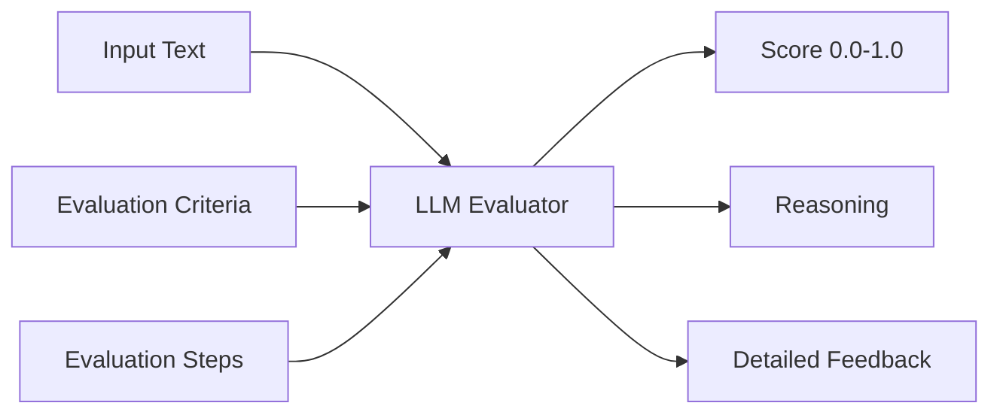

## Overview

CheckThat AI uses **DeepEval's G-Eval** framework to assess the quality of normalized claims. Evaluation metrics provide objective scores (0.0-1.0) and detailed feedback to guide refinement and ensure claims meet fact-checking standards.

<Info>
The evaluation service is implemented in `api/services/evaluation/evaluate.py` and integrates with the refinement pipeline to continuously improve claim quality.
</Info>

## G-Eval: GPT-Based Evaluation

### What is G-Eval?

G-Eval uses large language models (GPT, Claude, Gemini, etc.) as evaluators to score text against custom criteria. Unlike traditional metrics, G-Eval:

- Understands context and nuance
- Provides detailed reasoning for scores
- Adapts to domain-specific evaluation needs
- Scales from 0.0 (poor) to 1.0 (excellent)

### How G-Eval Works



### Creating G-Eval Metrics

```python From api/services/evaluation/evaluate.py:24-105
from deepeval.metrics import GEval
from deepeval.test_case import LLMTestCase, LLMTestCaseParams

def create_evaluation_metrics(
    metric_types: List[str], 
    deepeval_model: Any
) -> Dict[str, GEval]:
    """
    Create G-Eval metrics based on requested evaluation types.
    """
    metric_definitions = {
        "verifiability": {
            "name": "Verifiability Assessment",
            "criteria": "Evaluate how easily this claim can be verified",
            "evaluation_steps": [
                "Check if the claim contains specific, factual assertions",
                "Assess whether evidence can be found to support or refute",
                "Consider if the claim is time-sensitive or location-specific",
                "Determine if the claim requires expert knowledge"
            ]
        },
        # ... more metrics
    }
    
    metrics = {}
    for metric_type in metric_types:
        metrics[metric_type] = GEval(
            name=metric_definitions[metric_type]["name"],
            criteria=metric_definitions[metric_type]["criteria"],
            evaluation_steps=metric_definitions[metric_type]["evaluation_steps"],
            evaluation_params=[LLMTestCaseParams.INPUT, 
                              LLMTestCaseParams.ACTUAL_OUTPUT],
            model=deepeval_model,
            threshold=0.5
        )
    return metrics
```

## Available Evaluation Metrics

CheckThat AI provides 5 built-in G-Eval metrics:

### 1. Verifiability Assessment

Evaluates how easily a claim can be verified using reliable sources.

<AccordionGroup>
  <Accordion title="Evaluation Steps" icon="list-check">
    - Check if the claim contains **specific, factual assertions**
    - Assess whether **evidence can be found** to support or refute the claim
    - Consider if the claim is **time-sensitive or location-specific**
    - Determine if the claim requires **expert knowledge** to verify
  </Accordion>
  
  <Accordion title="Example Evaluation" icon="magnifying-glass">
    **Claim**: "Gargling water can protect against coronavirus"
    
    **Score**: 0.75
    
    **Reasoning**: The claim is specific and testable through medical research. It can be verified by checking scientific literature on coronavirus transmission and gargling effectiveness. However, it lacks specificity about the type of coronavirus and gargling method, reducing precision.
  </Accordion>
</AccordionGroup>

### 2. Check-Worthiness Assessment

Evaluates the importance and urgency of fact-checking the claim.

<AccordionGroup>
  <Accordion title="Evaluation Steps" icon="list-check">
    - Assess **potential harm** if the claim is false
    - Consider the claim's **reach and influence** potential
    - Evaluate **public interest** in the claim's veracity
    - Determine if the claim could **mislead vulnerable populations**
  </Accordion>
  
  <Accordion title="Example Evaluation" icon="magnifying-glass">
    **Claim**: "St.Austin University North Carolina says eating vaginal fluid makes you immune to cancer"
    
    **Score**: 0.95
    
    **Reasoning**: Extremely high check-worthiness. The claim could cause significant harm if false (cancer patients avoiding treatment), has high potential reach due to cancer's prevalence, and could mislead vulnerable populations seeking alternative treatments. Urgent fact-checking required.
  </Accordion>
</AccordionGroup>

### 3. Factual Consistency Assessment

Evaluates if the claim accurately represents facts without distortion.

<AccordionGroup>
  <Accordion title="Evaluation Steps" icon="list-check">
    - Check if the claim introduces **new information not in the source**
    - Verify the claim doesn't **misrepresent the original context**
    - Ensure the claim maintains **factual accuracy**
    - Confirm the claim doesn't contain **hallucinations**
  </Accordion>
  
  <Accordion title="Example Evaluation" icon="magnifying-glass">
    **Claim**: "Pakistani government appoints former army general to head medical regulatory body"
    
    **Source**: "Lieutenant Retired General Asif Mumtaz appointed as Chairman Pakistan Medical Commission PMC"
    
    **Score**: 0.88
    
    **Reasoning**: High factual consistency. The claim accurately represents the source material without adding unverified information. Minor generalization ("former army general" vs. specific name) is appropriate for normalization. No hallucinations or distortions detected.
  </Accordion>
</AccordionGroup>

### 4. Clarity Assessment

Evaluates how clear and understandable the claim is.

<AccordionGroup>
  <Accordion title="Evaluation Steps" icon="list-check">
    - Check if the claim is written in **clear, simple language**
    - Assess if the claim avoids **ambiguous terms**
    - Determine if the claim is **self-contained**
    - Evaluate if the claim is **concise yet comprehensive**
  </Accordion>
  
  <Accordion title="Example Evaluation" icon="magnifying-glass">
    **Claim**: "Late actor and martial artist Bruce Lee playing table tennis with a set of nunchucks"
    
    **Score**: 0.82
    
    **Reasoning**: Good clarity with simple, descriptive language. The claim is self-contained and understandable without context. Minor reduction for present participle "playing" which could be clearer as "played" to indicate historical fact. Otherwise concise and comprehensive.
  </Accordion>
</AccordionGroup>

### 5. Relevance Assessment

Evaluates how relevant the claim is to current events or public discourse.

<AccordionGroup>
  <Accordion title="Evaluation Steps" icon="list-check">
    - Assess if the claim addresses **current issues**
    - Consider the claim's **impact on public opinion**
    - Evaluate the claim's **newsworthiness**
    - Determine if the claim affects **policy or decision-making**
  </Accordion>
  
  <Accordion title="Example Evaluation" icon="magnifying-glass">
    **Claim**: "Drinking water at specific times can have different health benefits"
    
    **Score**: 0.58
    
    **Reasoning**: Moderate relevance. The claim addresses ongoing health and wellness discourse but is not tied to breaking news or urgent policy decisions. Has general public interest but low impact on critical decision-making. Somewhat evergreen content.
  </Accordion>
</AccordionGroup>

## Metric Configuration

### Custom Thresholds

Set minimum acceptable scores for each metric:

```python
eval_metric = GEval(
    name="Verifiability Assessment",
    criteria="Evaluate verifiability...",
    evaluation_steps=[...],
    model=deepeval_model,
    threshold=0.7  # Require 0.7+ score to pass
)

# After evaluation
test_case = LLMTestCase(input=query, actual_output=claim)
eval_metric.measure(test_case)

if eval_metric.score >= eval_metric.threshold:
    print("Claim passed!")
else:
    print(f"Claim failed: {eval_metric.score} < {eval_metric.threshold}")
```

### Combining Multiple Metrics

```python From api/services/evaluation/evaluate.py:108-156
def evaluate_text_with_metrics(
    text: str,
    metrics: Dict[str, GEval]
) -> Dict[str, Dict[str, Any]]:
    """
    Evaluate text using provided metrics.
    """
    results = {}
    
    for metric_name, metric in metrics.items():
        try:
            # Create test case
            test_case = LLMTestCase(
                input=f"Evaluate this text: {text}",
                actual_output=text,
            )
            
            # Measure
            metric.measure(test_case)
            
            # Store results
            results[metric_name] = {
                "score": metric.score,
                "reasoning": getattr(metric, 'reasoning', ''),
                "threshold": metric.threshold,
                "passed": metric.score >= metric.threshold
            }
        except Exception as e:
            results[metric_name] = {
                "score": 0.0,
                "error": str(e),
                "passed": False
            }
    
    return results
```

## Evaluation Reports

Comprehensive evaluation results are returned in structured reports:

```python From api/types/completions.py:30-37
class EvaluationReport(BaseModel):
    """Evaluation report for post-normalization quality audits."""
    metrics_used: List[str]
    scores: Dict[str, float]  # metric_name -> score (0.0-1.0)
    detailed_results: Dict[str, Dict[str, Any]]
    timestamp: str  # ISO format
    report_url: Optional[str]  # Cloud storage URL if saved
    model_info: Optional[Dict[str, Any]]
```

### Example Evaluation Report

```json
{
  "evaluation_report": {
    "metrics_used": [
      "verifiability",
      "check_worthiness",
      "factual_consistency",
      "clarity"
    ],
    "scores": {
      "verifiability": 0.85,
      "check_worthiness": 0.92,
      "factual_consistency": 0.88,
      "clarity": 0.79
    },
    "detailed_results": {
      "verifiability": {
        "score": 0.85,
        "reasoning": "Claim contains specific factual assertions that can be verified through medical research databases. Time-sensitivity is clear (coronavirus pandemic context).",
        "threshold": 0.5,
        "passed": true
      },
      "check_worthiness": {
        "score": 0.92,
        "reasoning": "High potential for harm if false - health misinformation during pandemic. Wide reach expected due to public health concern. Vulnerable populations at risk.",
        "threshold": 0.5,
        "passed": true
      }
    },
    "timestamp": "2025-03-04T14:32:18.123456",
    "model_info": {
      "model_name": "gpt-4o",
      "evaluation_model": "gpt-4o"
    }
  }
}
```

## Score Interpretation

### Score Ranges

<CardGroup cols={2}>
  <Card title="0.9 - 1.0: Excellent" icon="star" color="#10b981">
    Claim meets or exceeds all quality standards. Ready for professional fact-checking without modification.
  </Card>
  
  <Card title="0.7 - 0.89: Good" icon="thumbs-up" color="#3b82f6">
    Claim meets most quality standards. Minor improvements may be beneficial but not required.
  </Card>
  
  <Card title="0.5 - 0.69: Acceptable" icon="circle-check" color="#f59e0b">
    Claim meets minimum standards but has room for improvement. Consider refinement for critical applications.
  </Card>
  
  <Card title="0.0 - 0.49: Needs Improvement" icon="triangle-exclamation" color="#ef4444">
    Claim does not meet quality standards. Refinement strongly recommended before fact-checking.
  </Card>
</CardGroup>

### Recommended Thresholds by Use Case

<Tabs>
  <Tab title="High-Stakes Fact-Checking">
    **Threshold: 0.8+**
    
    Use for:
    - Health misinformation
    - Political claims
    - Financial advice
    - Legal statements
    
    Requires highest quality claims with excellent verifiability and minimal ambiguity.
  </Tab>
  
  <Tab title="General Fact-Checking">
    **Threshold: 0.6+**
    
    Use for:
    - News verification
    - Social media monitoring
    - Content moderation
    - General research
    
    Balanced quality standards suitable for most fact-checking applications.
  </Tab>
  
  <Tab title="Claim Discovery">
    **Threshold: 0.4+**
    
    Use for:
    - Claim detection
    - Exploratory analysis
    - Dataset creation
    - Preliminary screening
    
    Lower threshold allows capturing more claims for human review.
  </Tab>
</Tabs>

## Using Evaluation Metrics

### API Request with Evaluation

```python
import openai

client = openai.OpenAI(
    base_url="https://api.checkthat.ai/v1",
    api_key="your-checkthat-api-key"
)

response = client.chat.completions.create(
    model="gpt-4o",
    messages=[
        {"role": "user", "content": "Some health post..."}
    ],
    extra_body={
        "evaluate_claims": True,
        "evaluation_metrics": [
            "verifiability",
            "check_worthiness",
            "factual_consistency"
        ],
        "evaluation_model": "gpt-4o"
    }
)

# Access evaluation results
eval_report = response.evaluation_report
print(f"Verifiability: {eval_report.scores['verifiability']}")
print(f"Check-Worthiness: {eval_report.scores['check_worthiness']}")
```

### Combined Evaluation + Refinement

Evaluation metrics automatically guide the refinement process:

```python
response = client.chat.completions.create(
    model="gpt-4o",
    messages=[{"role": "user", "content": "Health claim..."}],
    extra_body={
        # Enable both evaluation and refinement
        "evaluate_claims": True,
        "refine_claims": True,
        "refine_threshold": 0.7,  # Target score
        "refine_max_iters": 3,
        # Metrics guide refinement
        "evaluation_metrics": ["verifiability", "clarity"]
    }
)

# View refinement history with scores
for entry in response.refinement_metadata.refinement_history:
    print(f"{entry.claim_type}: {entry.score} - {entry.claim}")
```

## Model Selection for Evaluation

Different models excel at different evaluation tasks:

<CardGroup cols={2}>
  <Card title="GPT-4o" icon="brain" color="#10b981">
    **Best for**: Balanced performance across all metrics
    
    Excellent reasoning, fast inference, cost-effective
  </Card>
  
  <Card title="Claude Opus 4.1" icon="sparkles" color="#8b5cf6">
    **Best for**: Nuanced evaluation, contextual understanding
    
    Superior at detecting subtle issues, highest quality
  </Card>
  
  <Card title="Gemini 2.5 Pro" icon="google" color="#3b82f6">
    **Best for**: Factual consistency, verifiability
    
    Strong fact-checking capabilities, good reasoning
  </Card>
  
  <Card title="Grok 4" icon="x" color="#1d4ed8">
    **Best for**: Real-time claims, current events
    
    Access to up-to-date information, strong relevance assessment
  </Card>
</CardGroup>

<Tip>
For production applications, use **GPT-4o** or **Claude Sonnet 4** for the best balance of quality, speed, and cost. Reserve premium models like Claude Opus for high-stakes evaluations.
</Tip>

## Best Practices

<Steps>
  <Step title="Choose Appropriate Metrics">
    Select 2-4 metrics most relevant to your use case. More metrics = slower/costlier but more comprehensive.
  </Step>
  
  <Step title="Set Realistic Thresholds">
    Start with 0.6 and adjust based on your quality requirements. Too high = many false negatives.
  </Step>
  
  <Step title="Combine with Refinement">
    Use evaluation metrics to guide automatic refinement for best results.
  </Step>
  
  <Step title="Monitor Score Distributions">
    Track metric scores over time to identify systemic issues in claim normalization.
  </Step>
  
  <Step title="Validate with Human Review">
    Periodically compare metric scores with human judgments to ensure alignment.
  </Step>
</Steps>

## Next Steps

<CardGroup cols={2}>
  <Card title="Refinement Pipeline" icon="arrows-rotate" href="/concepts/refinement-pipeline">
    Learn how evaluation metrics drive iterative claim improvement
  </Card>
  
  <Card title="Supported Models" icon="microchip" href="/concepts/supported-models">
    Choose the best model for your evaluation needs
  </Card>
</CardGroup>