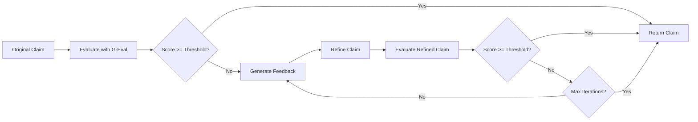

## Overview

The Refinement Pipeline is an iterative quality improvement system that automatically enhances normalized claims through AI-powered feedback and self-correction. It uses **DeepEval metrics** to evaluate claims and **refinement algorithms** to improve them until they meet quality thresholds.

<Info>
The refinement service is located in `api/services/refinement/refine.py` and integrates with DeepEval's G-Eval metrics for quality assessment.
</Info>

## How Refinement Works

### Architecture Overview



### The RefinementService Class

The core refinement engine accepts configurable parameters:

```python From api/services/refinement/refine.py:46-62
class RefinementService:
    def __init__(
        self, 
        model: Union[GPTModel, GeminiModel, AnthropicModel, GrokModel], 
        threshold: float = 0.5,
        max_iters: int = 3,
        metrics: Optional[List[str]] = None,
    ):
        self.model = model  # DeepEval model for evaluation
        self.threshold = threshold  # Minimum quality score
        self.max_iters = max_iters  # Maximum refinement iterations
        self.metrics = metrics  # Custom evaluation metrics
```

<ParamField path="model" type="DeepEval Model" required>
  DeepEval-compatible model instance (GPT, Gemini, Anthropic, or Grok)
</ParamField>

<ParamField path="threshold" type="float" default="0.5">
  Minimum quality score (0.0-1.0) required to accept a claim
</ParamField>

<ParamField path="max_iters" type="int" default="3">
  Maximum number of refinement iterations before returning the best result
</ParamField>

<ParamField path="metrics" type="GEval | None" default="None">
  Custom G-Eval metric. If None, uses default claim quality assessment
</ParamField>

## Refinement Algorithms

### Self-Refine Algorithm

The self-refine algorithm improves claims through iterative self-correction:

<Steps>
  <Step title="Initial Evaluation">
    Evaluate the original claim using G-Eval metrics
    ```python
    test_case = LLMTestCase(
        input=original_query,
        actual_output=current_claim,
    )
    
    eval_result = evaluate(test_cases=[test_case], metrics=[eval_metric])
    original_score = eval_result.test_results[0].metrics_data[0].score
    ```
  </Step>
  
  <Step title="Threshold Check">
    If the score meets the threshold, return the original claim
    ```python
    if original_score >= self.threshold:
        return current_response, refinement_history
    ```
  </Step>
  
  <Step title="Iterative Refinement">
    Generate feedback and refine the claim up to `max_iters` times
    ```python
    for i in range(self.max_iters):
        refine_user_prompt = f"""
        ## Original Query
        {original_query}
        
        ## Current Response  
        {current_claim}
        
        ## Feedback
        {eval_result.test_results[0].metrics_data[0].reason}
        
        ## Task
        Refine the current response based on the feedback to 
        improve its accuracy, verifiability, and overall quality.
        """
        
        refined_response = client.generate_response(
            user_prompt=refine_user_prompt,
            sys_prompt=self.refine_sys_prompt
        )
    ```
  </Step>
  
  <Step title="Re-evaluation">
    Evaluate the refined claim and check if it meets the threshold
    ```python
    test_case = LLMTestCase(
        input=original_query,
        actual_output=refined_claim,
    )
    
    eval_result = evaluate(test_cases=[test_case], metrics=[eval_metric])
    score = eval_result.test_results[0].metrics_data[0].score
    
    if score >= self.threshold:
        break  # Success!
    ```
  </Step>
</Steps>

### Cross-Refine Algorithm

Cross-refine uses feedback from a **different model** to provide diverse perspectives:

<CodeGroup>

```python Feedback Generation
# From api/_utils/prompts.py:217-230
feedback_prompt = """
You are provided with a generated response and a user prompt.
Your task is to provide detailed, constructive feedback based on 
the criteria provided.

Please score the response on the following criteria using a 0-10 
scale:
1. **Verifiability**
2. **Likelihood of Being False**
3. **Public Interest**
4. **Potential Harm**
5. **Check-Worthiness**

For each criterion, provide:
- A score (0-10)
- Provide a short, precise justification in 1 sentence.
"""
```

```python Refinement Execution
# From api/_utils/prompts.py:252-264
refine_sys_prompt = """
# Identity
You are a professional fact-checker and expert in claim 
normalization.

# Instructions
* Refine the generated response in light of the feedback provided.
* Only include the refined, normalized claim in your response.
* If no meaningful refinement is necessary, re-output the original 
  normalized claim as-is.
* If the response is not decontextualized, stand-alone, and 
  verifiable, improve it by adding more context from the original 
  post if needed.
"""
```

</CodeGroup>

## DeepEval Integration

### G-Eval Metrics

Refinement uses DeepEval's **G-Eval** (GPT-Evaluation) for quality assessment:

```python Default G-Eval Configuration
# From api/services/refinement/refine.py:76-83
eval_metric = GEval(
    name="Claim Quality Assessment",
    criteria=STATIC_EVAL_SPECS.criteria,
    evaluation_params=[LLMTestCaseParams.INPUT, 
                      LLMTestCaseParams.ACTUAL_OUTPUT],
    model=self.model,
    threshold=self.threshold
)
```

### Static Evaluation Criteria

The default evaluation criteria from `api/types/evals.py:25-50`:

<Accordion title="View Complete Evaluation Criteria" icon="list-check">

```python
STATIC_EVAL_SPECS = StaticEvaluation(
    criteria="""Evaluate the normalized claim against the following 
    criteria: Verifiability and Self-Containment, Claim Centrality 
    and Extraction Quality, Conciseness and Clarity, 
    Check-Worthiness Alignment, and Factual Consistency""",
    
    evaluation_steps=[
        # Verifiability and Self-Containment
        "Check if the claim contains verifiable factual assertions ",
        "Check if the claim is self-contained without requiring 
         additional context",
        
        # Claim Centrality and Extraction Quality
        "Check if the normalized claim captures the central assertion",
        "Check if the claim represents the core factual assertion",
        
        # Conciseness and Clarity
        "Check if the claim is presented in a straightforward, 
         concise manner",
        "Check if the claim is significantly shorter than source posts",
        
        # Check-Worthiness Alignment
        "Check if the normalized claim meets check-worthiness standards",
        "Check if the claim has general public interest, potential for 
         harm",
        
        # Factual Consistency
        "Check if the normalized claim is factually consistent with 
         the source",
        "Check if the claim accurately reflects the original assertion",
    ]
)
```

</Accordion>

### Thread-Safe Execution

<Warning>
DeepEval creates its own event loop, which conflicts with FastAPI's uvloop. CheckThat AI uses a thread pool executor to run evaluations safely:
</Warning>

```python Thread Pool Implementation
# From api/services/refinement/refine.py:34-44
from concurrent.futures import ThreadPoolExecutor

_executor = ThreadPoolExecutor(max_workers=4)

def _run_evaluation_in_thread(test_case: LLMTestCase, 
                              metric: BaseMetric):
    """
    Run DeepEval evaluation in a separate thread to avoid 
    uvloop conflicts.
    """
    return evaluate(test_cases=[test_case], metrics=[metric])

# Usage
future = _executor.submit(_run_evaluation_in_thread, 
                          test_case, eval_metric)
eval_result = future.result()  # Blocks until complete
```

## Refinement History Tracking

Every refinement iteration is tracked and returned to the user:

```python From api/types/completions.py:39-54
class ClaimType(str, Enum):
    ORIGINAL = "original"
    REFINED = "refined"
    FINAL = "final"

class RefinementHistory(BaseModel):
    claim_type: ClaimType
    claim: Optional[str]
    score: float  # 0.0 to 1.0
    feedback: Optional[str]

class RefinementMetadata(BaseModel):
    metric_used: Optional[str]
    threshold: Optional[float]
    refinement_model: Optional[str]
    refinement_history: List[RefinementHistory]
```

### Example Refinement History

```json
{
  "refinement_metadata": {
    "metric_used": "Claim Quality Assessment",
    "threshold": 0.7,
    "refinement_model": "gpt-4o",
    "refinement_history": [
      {
        "claim_type": "original",
        "claim": "Drinking lots of water cures coronavirus",
        "score": 0.45,
        "feedback": "Claim is not self-contained and overstates effectiveness"
      },
      {
        "claim_type": "refined",
        "claim": "Some health sources recommend drinking water to help prevent coronavirus infection",
        "score": 0.72,
        "feedback": "Improved verifiability and reduced overgeneralization"
      },
      {
        "claim_type": "final",
        "claim": "Some health sources recommend drinking water to help prevent coronavirus infection",
        "score": 0.72,
        "feedback": "Meets quality threshold"
      }
    ]
  }
}
```

## Using the Refinement Pipeline

### API Request with Refinement

```python
import openai

client = openai.OpenAI(
    base_url="https://api.checkthat.ai/v1",
    api_key="your-checkthat-api-key"
)

response = client.chat.completions.create(
    model="gpt-4o",
    messages=[
        {"role": "user", "content": "Eating garlic prevents COVID-19"}
    ],
    # Refinement parameters
    extra_body={
        "refine_claims": True,
        "refine_threshold": 0.7,
        "refine_max_iters": 3,
        "refine_model": "gpt-4o"
    }
)

print(response.choices[0].message.content)
print(response.refinement_metadata.refinement_history)
```

<ParamField path="refine_claims" type="bool" default="false">
  Enable the refinement pipeline
</ParamField>

<ParamField path="refine_threshold" type="float" default="0.5">
  Minimum quality score to accept (0.0-1.0)
</ParamField>

<ParamField path="refine_max_iters" type="int" default="3">
  Maximum refinement iterations
</ParamField>

<ParamField path="refine_model" type="string">
  Model to use for refinement (supports all [supported models](/concepts/supported-models))
</ParamField>

## Performance Considerations

<CardGroup cols={2}>
  <Card title="Latency" icon="clock">
    Each refinement iteration adds ~2-5 seconds depending on the model. Plan for 6-15 seconds total with 3 iterations.
  </Card>
  
  <Card title="Cost" icon="dollar-sign">
    Each iteration doubles the API calls (evaluation + refinement). Use higher thresholds for cost-sensitive applications.
  </Card>
  
  <Card title="Quality" icon="star">
    Higher thresholds (0.7-0.9) produce better claims but may require more iterations. Balance quality vs. speed/cost.
  </Card>
  
  <Card title="Model Selection" icon="brain">
    Stronger models (GPT-4, Claude Opus) produce better refinements. Faster models (GPT-4o-mini, Claude Haiku) reduce latency.
  </Card>
</CardGroup>

## Error Handling

The refinement pipeline gracefully handles failures:

```python From api/services/refinement/refine.py:172-185
except Exception as e:
    logger.warning(f"Failed to refine claim: {e}")
    # Return original response with error in history
    error_history = RefinementHistory(
        claim_type=ClaimType.FINAL,
        claim=current_claim,
        score=0.0,
        feedback=f"Refinement failed: {str(e)}"
    )
    return current_response or original_response, refinement_history
```

<Tip>
If refinement fails, the API returns the original claim with error details in the `refinement_history`. Your application will never receive an error response due to refinement issues.
</Tip>

## Next Steps

<CardGroup cols={2}>
  <Card title="Evaluation Metrics" icon="chart-line" href="/concepts/evaluation-metrics">
    Learn about G-Eval and other quality metrics used in refinement
  </Card>
  
  <Card title="Supported Models" icon="microchip" href="/concepts/supported-models">
    Choose the best model for your refinement needs
  </Card>
</CardGroup>