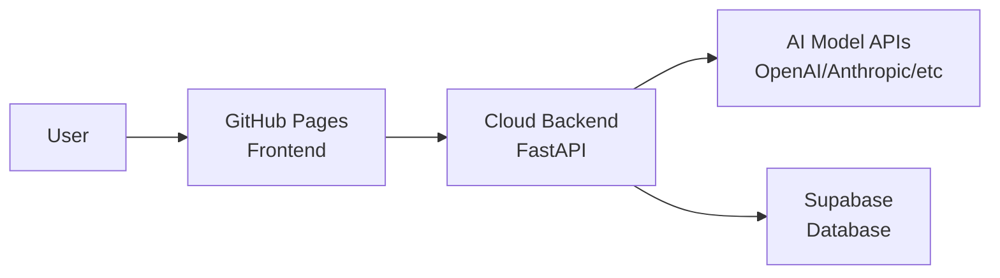

## Overview

CheckThat AI consists of two deployable components:

1. **Frontend**: Static React application (deployed to GitHub Pages)
2. **Backend**: FastAPI application (deployed to cloud hosting)

This guide covers production deployment for both components, including configuration, security, and optimization.

## Architecture Overview



## Frontend Deployment (GitHub Pages)

The frontend is automatically deployed to GitHub Pages using GitHub Actions.

### Prerequisites

<CardGroup cols={2}>
  <Card title="GitHub Repository" icon="github">
    Repository with GitHub Pages enabled
  </Card>
  <Card title="Custom Domain" icon="globe">
    Optional: Custom domain (CNAME file)
  </Card>
  <Card title="Secrets Configuration" icon="lock">
    GitHub repository secrets configured
  </Card>
  <Card title="Node.js 18+" icon="node-js">
    For build process
  </Card>
</CardGroup>

### Deployment Steps

<Steps>
  <Step title="Configure Repository Secrets">
    Add these secrets to your GitHub repository (Settings → Secrets → Actions):

    | Secret Name | Description | Example |
    |-------------|-------------|----------|
    | `VITE_BACKEND_URL` | Backend API URL | `https://api.checkthat-ai.com` |
    | `VITE_SUPABASE_URL` | Supabase project URL | `https://xxx.supabase.co` |
    | `VITE_SUPABASE_ANON_KEY` | Supabase anonymous key | `eyJhbGc...` |

    <Warning>
      Never commit these values to your repository. Always use GitHub Secrets.
    </Warning>
  </Step>

  <Step title="Configure GitHub Pages">
    In your repository settings:

    1. Navigate to **Settings → Pages**
    2. Under **Source**, select **GitHub Actions**
    3. Save the configuration
  </Step>

  <Step title="Set Up Custom Domain (Optional)">
    If using a custom domain:

    1. Create a `CNAME` file in the repository root:
       ```
       www.checkthat-ai.com
       ```

    2. Configure DNS records with your domain provider:
       ```
       Type: CNAME
       Name: www
       Value: <username>.github.io
       ```

    3. Update `vite.config.ts` base URL:
       ```typescript
       export default defineConfig({
         base: 'https://www.checkthat-ai.com/',
         // ... other config
       })
       ```
  </Step>

  <Step title="Deploy via GitHub Actions">
    The deployment workflow triggers automatically on push to `main`:

    ```yaml
    # .github/workflows/gh-pages-deploy.yml
    name: Deploy to GitHub Pages

    on:
      push:
        branches: ["main"]
      workflow_dispatch:

    jobs:
      build:
        runs-on: ubuntu-latest
        steps:
          - name: Checkout
            uses: actions/checkout@v4
          
          - name: Setup Node.js
            uses: actions/setup-node@v6
            with:
              node-version: '18'
              cache: 'npm'
              cache-dependency-path: app/package-lock.json
          
          - name: Install dependencies
            working-directory: app
            run: npm ci
          
          - name: Build project
            working-directory: app
            env:
              VITE_BACKEND_URL: ${{ secrets.VITE_BACKEND_URL }}
              VITE_SUPABASE_URL: ${{ secrets.VITE_SUPABASE_URL }}
              VITE_SUPABASE_ANON_KEY: ${{ secrets.VITE_SUPABASE_ANON_KEY }}
            run: npm run build
          
          - name: Upload artifact
            uses: actions/upload-pages-artifact@v3
            with:
              path: ./app/dist

      deploy:
        needs: build
        runs-on: ubuntu-latest
        steps:
          - name: Deploy to GitHub Pages
            uses: actions/deploy-pages@v4
    ```
  </Step>

  <Step title="Manual Deployment (Alternative)">
    To deploy manually without GitHub Actions:

    ```bash
    # Build for production
    cd src/app
    npm run build

    # Deploy to GitHub Pages
    npm run deploy

    # Commit and push
    git add .
    git commit -m "Deploy to GitHub Pages"
    git push origin main
    ```
  </Step>
</Steps>

### Frontend Build Configuration

The production build is configured in `vite.config.ts`:

```typescript
import { defineConfig } from 'vite'
import react from '@vitejs/plugin-react'
import tailwindcss from '@tailwindcss/vite'

export default defineConfig({
  plugins: [react(), tailwindcss()],
  base: 'https://www.checkthat-ai.com/',
  resolve: {
    alias: {
      '@': path.resolve(__dirname, './src'),
    },
  },
  build: {
    outDir: 'dist',
    sourcemap: false,  // Disable for production
    minify: 'terser',  // Minification
    rollupOptions: {
      output: {
        manualChunks: {  // Code splitting
          vendor: ['react', 'react-dom', 'react-router-dom'],
        },
      },
    },
  },
})
```

## Backend Deployment (Cloud Hosting)

The FastAPI backend can be deployed to various cloud platforms. This guide covers general deployment principles applicable to Render, Railway, Fly.io, AWS, GCP, or Azure.

### Prerequisites

<CardGroup cols={2}>
  <Card title="Cloud Platform Account" icon="cloud">
    Render, Railway, Fly.io, etc.
  </Card>
  <Card title="API Keys" icon="key">
    OpenAI, Anthropic, Gemini, xAI
  </Card>
  <Card title="Supabase Project" icon="database">
    Database and authentication
  </Card>
  <Card title="Python 3.8+" icon="python">
    Runtime environment
  </Card>
</CardGroup>

### Deployment Configuration

<Steps>
  <Step title="Set Environment Variables">
    Configure these environment variables in your cloud platform:

    <Accordion title="View All Environment Variables">
      See [Environment Variables](/deployment/environment-variables) for complete list.

      **Required:**
      - `ENV_TYPE=prod`
      - `CORS_ORIGINS=*` (or specific frontend domain)
      - At least one model provider API key
      - Supabase configuration (if using authentication)

      **Optional:**
      - `LOG_LEVEL=INFO`
      - Additional model provider keys
    </Accordion>
  </Step>

  <Step title="Configure CORS">
    Update CORS settings in `api/core/config.py`:

    ```python
    class Settings(BaseSettings):
        env_type: str = os.getenv("ENV_TYPE", "dev")
        cors_origins: str = os.getenv("CORS_ORIGINS", "")
        
        @property
        def allowed_origins(self) -> List[str]:
            if self.cors_origins:
                origins = [origin.strip() for origin in self.cors_origins.split(",")]
                if "*" in origins:
                    return ["*"]  # Public API
                return origins
            
            # Production defaults
            if self.env_type == "prod":
                return ["*"]  # Or specify your frontend domain
            return ["*"]
    ```

    <Warning>
      For public APIs, use `CORS_ORIGINS=*`. For private APIs, specify your frontend domain:
      ```bash
      CORS_ORIGINS=https://www.checkthat-ai.com,https://checkthat-ai.com
      ```
    </Warning>
  </Step>

  <Step title="Set Up Application Server">
    The backend uses Uvicorn as the ASGI server. Configure startup command:

    ```bash
    uvicorn api.main:app --host 0.0.0.0 --port 8000 --workers 4
    ```

    **For development mode:**
    ```bash
    fastapi dev main.py --host 0.0.0.0 --port 8000
    ```

    **For production mode:**
    ```bash
    fastapi run main.py --host 0.0.0.0 --port 8000
    ```
  </Step>

  <Step title="Install Dependencies">
    Ensure your cloud platform installs dependencies from `requirements.txt`:

    ```txt
    # Core FastAPI and server
    fastapi[standard]
    uvicorn[standard]

    # AI/ML Model APIs
    openai
    together
    anthropic
    google-genai
    xai-sdk
    instructor

    # Data validation and settings
    pydantic
    pydantic-settings

    # Database and authentication
    supabase
    pyjwt
    requests
    httpx

    # Data processing and analysis
    numpy
    pandas
    nltk
    scipy
    scikit-learn
    tiktoken
    deepeval

    # Utilities
    typing-extensions
    ```
  </Step>

  <Step title="Platform-Specific Deployment">
    <Tabs>
      <Tab title="Render">
        Create a `render.yaml` file:

        ```yaml
        services:
          - type: web
            name: checkthat-api
            env: python
            buildCommand: pip install -r api/requirements.txt
            startCommand: cd api && uvicorn main:app --host 0.0.0.0 --port $PORT
            envVars:
              - key: ENV_TYPE
                value: prod
              - key: PYTHON_VERSION
                value: 3.11.0
        ```
      </Tab>

      <Tab title="Railway">
        Railway automatically detects Python apps. Configure in `railway.toml`:

        ```toml
        [build]
        builder = "NIXPACKS"
        buildCommand = "pip install -r api/requirements.txt"

        [deploy]
        startCommand = "cd api && uvicorn main:app --host 0.0.0.0 --port $PORT"
        restartPolicyType = "ON_FAILURE"
        restartPolicyMaxRetries = 10
        ```
      </Tab>

      <Tab title="Docker">
        Create a `Dockerfile`:

        ```dockerfile
        FROM python:3.11-slim

        WORKDIR /app

        COPY api/requirements.txt .
        RUN pip install --no-cache-dir -r requirements.txt

        COPY api/ .

        EXPOSE 8000

        CMD ["uvicorn", "main:app", "--host", "0.0.0.0", "--port", "8000"]
        ```

        Build and run:
        ```bash
        docker build -t checkthat-api .
        docker run -p 8000:8000 --env-file .env checkthat-api
        ```
      </Tab>
    </Tabs>
  </Step>
</Steps>

## Security Best Practices

<AccordionGroup>
  <Accordion title="API Key Management">
    - **Never commit API keys** to version control
    - Use environment variables for all sensitive data
    - Rotate API keys regularly
    - Use different keys for development and production
    - Monitor API usage and set spending limits
  </Accordion>

  <Accordion title="CORS Configuration">
    - For public APIs: Use `CORS_ORIGINS=*`
    - For private APIs: Specify exact frontend domains
    - Never expose internal services to public CORS
    - Use HTTPS for all production URLs
  </Accordion>

  <Accordion title="Authentication & Authorization">
    - Enable Supabase Row Level Security (RLS)
    - Validate JWT tokens on the backend
    - Use Supabase service key only on backend
    - Never expose service keys to frontend
    - Implement rate limiting for API endpoints
  </Accordion>

  <Accordion title="Logging & Monitoring">
    - Set `LOG_LEVEL=INFO` for production
    - Never log API keys or sensitive data
    - Monitor error rates and response times
    - Set up alerts for critical errors
    - Use structured logging (JSON format)
  </Accordion>

  <Accordion title="Environment Configuration">
    - Set `ENV_TYPE=prod` for production
    - Use separate Supabase projects for dev/prod
    - Implement graceful error handling
    - Configure appropriate timeout values
    - Enable HTTPS only in production
  </Accordion>
</AccordionGroup>

## Performance Optimization

### Frontend Optimization

<Steps>
  <Step title="Build Optimization">
    - Enable code splitting in Vite configuration
    - Minify JavaScript and CSS
    - Tree-shake unused dependencies
    - Use production builds (never deploy dev builds)
  </Step>

  <Step title="Asset Optimization">
    - Compress images (use WebP format)
    - Lazy load components with React.lazy()
    - Use CDN for static assets
    - Enable Brotli/Gzip compression
  </Step>

  <Step title="Caching Strategy">
    - Set appropriate cache headers
    - Use service workers for offline support
    - Cache API responses where applicable
    - Version static assets
  </Step>
</Steps>

### Backend Optimization

<Steps>
  <Step title="Server Configuration">
    - Use multiple Uvicorn workers:
      ```bash
      uvicorn main:app --workers 4
      ```
    - Configure worker class based on workload:
      ```bash
      --worker-class uvicorn.workers.UvicornWorker
      ```
  </Step>

  <Step title="Database Optimization">
    - Enable connection pooling for Supabase
    - Use database indexes for frequent queries
    - Implement caching for repeated queries
    - Use async database operations
  </Step>

  <Step title="API Rate Limiting">
    - Implement rate limiting middleware
    - Cache LLM responses when appropriate
    - Use streaming responses for long-running tasks
    - Implement request queuing for high load
  </Step>
</Steps>

## Health Checks & Monitoring

Implement health check endpoints for monitoring:

```python
# api/routes/health.py
from fastapi import APIRouter

router = APIRouter()

@router.get("/health")
async def health_check():
    return {
        "status": "healthy",
        "version": "1.0.0",
        "environment": os.getenv("ENV_TYPE", "dev")
    }

@router.get("/readiness")
async def readiness_check():
    # Check database connection, external APIs, etc.
    return {"status": "ready"}
```

## Deployment Checklist

<Steps>
  <Step title="Pre-Deployment">
    - ✅ All environment variables configured
    - ✅ API keys valid and tested
    - ✅ Database schema deployed (Supabase)
    - ✅ Frontend built successfully
    - ✅ Backend tested locally
    - ✅ CORS configured correctly
    - ✅ Security review completed
  </Step>

  <Step title="Deployment">
    - ✅ Frontend deployed to GitHub Pages
    - ✅ Backend deployed to cloud platform
    - ✅ Custom domain configured (if applicable)
    - ✅ SSL/HTTPS enabled
    - ✅ Health checks passing
  </Step>

  <Step title="Post-Deployment">
    - ✅ Test all major features
    - ✅ Verify API connectivity
    - ✅ Check authentication flows
    - ✅ Monitor error logs
    - ✅ Set up monitoring alerts
    - ✅ Document deployment process
  </Step>
</Steps>

## Troubleshooting

<AccordionGroup>
  <Accordion title="Frontend Not Loading">
    - Check GitHub Pages deployment status
    - Verify `base` URL in `vite.config.ts`
    - Ensure CNAME file is correct
    - Check browser console for errors
    - Verify DNS configuration for custom domain
  </Accordion>

  <Accordion title="Backend Connection Errors">
    - Verify backend URL in frontend environment variables
    - Check CORS configuration
    - Ensure backend is running and healthy
    - Verify SSL certificate is valid
    - Check firewall/security group rules
  </Accordion>

  <Accordion title="API Key Errors">
    - Verify environment variables are set
    - Check API key validity with provider
    - Ensure sufficient quota/credits
    - Check for typos in variable names
    - Verify platform-specific env var syntax
  </Accordion>

  <Accordion title="Database Connection Issues">
    - Verify Supabase URL and keys
    - Check database schema is deployed
    - Ensure Row Level Security policies are correct
    - Verify network connectivity
    - Check Supabase project status
  </Accordion>
</AccordionGroup>

## Rollback Procedure

If deployment issues occur:

### Frontend Rollback

```bash
# Revert to previous commit
git revert HEAD
git push origin main

# GitHub Actions will automatically redeploy
```

### Backend Rollback

Most cloud platforms provide rollback options:

- **Render**: Click "Rollback" in dashboard
- **Railway**: Redeploy previous deployment
- **Docker**: Run previous image version

## Next Steps

<CardGroup cols={2}>
  <Card title="Environment Variables" icon="key" href="/deployment/environment-variables">
    Complete environment variable reference
  </Card>
  <Card title="Monitoring" icon="chart-line" href="/guides/monitoring">
    Set up monitoring and alerts
  </Card>
  <Card title="Scaling" icon="arrows-up-to-line" href="/guides/scaling">
    Scale your deployment
  </Card>
  <Card title="Security" icon="shield" href="/guides/security">
    Advanced security configuration
  </Card>
</CardGroup>
