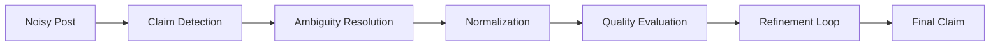

## What is Claim Detection?

Claim detection is the process of identifying factual assertions within text that can be objectively verified as true or false. In the context of CheckThat AI, claim detection is the foundational step in transforming noisy social media posts into verifiable, normalized statements.

### Formal Definition

<Info>
  **Claim**: A statement or assertion that can be objectively verified as true or false based on empirical evidence or reality.
  
  Claims differ from opinions, questions, or statements that cannot be empirically tested.
</Info>

### Examples

| Text | Classification | Reasoning |
|------|----------------|----------|
| "The COVID-19 vaccine contains microchips" | **Claim** | Can be verified through scientific evidence |
| "I think the government should lower taxes" | **Opinion** | Subjective preference, not verifiable |
| "Climate change is the most important issue" | **Opinion** | Value judgment, not factual assertion |
| "The Earth's average temperature has increased by 1.1°C since 1880" | **Claim** | Verifiable with scientific data |

## The Claim Detection Process

CheckThat AI implements a sophisticated multi-step approach to claim detection:

### Step 1: Sentence Splitting and Context Creation

The system begins by breaking down the input post into individual sentences and establishing contextual relationships:

```python
# Pseudocode representation
sentences = split_into_sentences(post)
for sentence in sentences:
    # Create context using surrounding sentences
    context = get_surrounding_context(
        sentence, 
        preceding=2, 
        following=2
    )
```

**Why Context Matters**: Social media posts often contain implicit references and assumptions that require surrounding text to understand.

### Step 2: Selection (Verifiability Assessment)

For each sentence, the system evaluates whether it contains verifiable information:

<Note>
  **Selection Criteria**:
  1. **Discard**: Sentences with no verifiable information
  2. **Rewrite**: Sentences mixing verifiable and unverifiable content (retain only verifiable parts)
  3. **Retain**: Sentences that are fully verifiable
</Note>

**Example**:
- **Input**: "I believe the government is hiding alien technology, which is terrible!"
- **Verifiable Core**: "The government is hiding alien technology"
- **Removed**: Subjective opinion ("I believe"), emotional reaction ("terrible")

### Step 3: Disambiguation

The system identifies and resolves two types of ambiguity:

#### Referential Ambiguity

Occurs when pronouns or references are unclear:

- **Ambiguous**: "They will update the policy next year"
  - Who is "They"?
  - Which "policy"?
  - Which "year"?

- **Resolved**: "The UK government will update immigration policy in 2026"

#### Structural Ambiguity

Occurs when grammar allows multiple interpretations:

- **Ambiguous**: "AI has advanced renewable energy and sustainable agriculture at Company A and Company B"
  
  **Two possible interpretations**:
  1. AI advanced both areas at both companies
  2. AI advanced renewable energy at Company A and agriculture at Company B

- **Resolution Standard**: A group of readers must be able to agree on the correct interpretation based on available context

<Info>
  **Critical Rule**: If ambiguity cannot be resolved, the sentence is discarded—even if it contains some unambiguous, verifiable components.
</Info>

### Step 4: Decomposition

The final step extracts specific, verifiable propositions that are **decontextualized**:

**Decontextualized Requirements**:
1. **Self-contained**: Can be understood in isolation
2. **Meaning-preserving**: Interpretation matches the original when combined with question and context
3. **Minimal**: Simplest possible discrete units of information

**Example**:
- **Complex**: "The new vaccine, which was developed by Moderna and approved last month, has been shown to reduce hospitalizations by 90% in clinical trials conducted across 12 countries"

- **Decomposed Claims**:
  1. "Moderna developed a new vaccine"
  2. "The vaccine was approved last month"
  3. "Clinical trials showed 90% reduction in hospitalizations"
  4. "Trials were conducted across 12 countries"

## Check-Worthiness Assessment

Not all claims are equally important to verify. CheckThat AI evaluates **check-worthiness** based on multiple criteria:

### Evaluation Dimensions

#### 1. Verifiability

**Question**: Can this claim be fact-checked using reliable sources?

- **High**: "The Eiffel Tower is 330 meters tall"
- **Medium**: "Most scientists agree on climate change"
- **Low**: "Everyone loves chocolate"

#### 2. Likelihood of Being False

**Question**: How likely is this claim to be misleading or false?

- **High**: "5G towers cause COVID-19"
- **Medium**: "Coffee cures cancer"
- **Low**: "Water is necessary for life"

#### 3. Public Interest

**Question**: Is this claim relevant to public discourse?

- **High**: "The president announced new tax policy"
- **Medium**: "Local school changes lunch menu"
- **Low**: "My neighbor painted their fence"

#### 4. Potential Harm

**Question**: Could believing this false claim cause damage?

- **High**: "Don't evacuate during the hurricane"
- **Medium**: "This unregulated supplement treats diabetes"
- **Low**: "Bigfoot was spotted in the woods"

#### 5. Check-Worthiness Score

**Question**: How urgent is it to fact-check this claim?

Calculated from the above dimensions using G-Eval (see [G-Eval](/research/g-eval)).

## Implementation in CheckThat AI

### System Prompt Engineering

The claim detection logic is encoded in the system prompt (`sys_prompt` in `/home/daytona/workspace/source/api/_utils/prompts.py:3-53`):

```python
sys_prompt = """# Identity
You are ClaimNorm, a helpful AI assistant and expert in 
claim detection, extraction, and normalization.

# Instructions
* You are given a noisy social media post...
* Your task is to detect, extract, and respond with a normalized claim.
* A claim is a statement that can be objectively verified...
"""
```

### Processing Strategies

CheckThat AI supports multiple prompting approaches:

#### Zero-Shot
Direct claim extraction without examples:
```
Instruction: Identify the central claim in: [POST]
```

#### Few-Shot
Learning from examples (see `few_shot_prompt` in prompts.py:59-118):
```
Example 1: [POST] → [NORMALIZED CLAIM]
Example 2: [POST] → [NORMALIZED CLAIM]
...
Now process: [NEW POST]
```

#### Chain-of-Thought (CoT)
Step-by-step reasoning (see `few_shot_CoT_prompt` in prompts.py:120-215):
```
1. Identify the actor: "Dr. Smith"
2. Find the action: "claims that..."
3. Extract evidence: "study shows..."
4. Formulate claim: [RESULT]
```

### Constraint Enforcement

The system enforces strict constraints during claim detection:

<Note>
  **Extraction Rules**:
  - Use **only words from the original text** (no inference)
  - Maximum **25 words** per claim
  - **Single sentence** format
  - **Self-contained** (no external context required)
  - **Preserve named entities** exactly as they appear
  - **Maintain sentiment** (negative claims stay negative)
  - **Extract, don't summarize** (no interpretation)
</Note>

## Relation to Claim Normalization

Claim detection is the first phase of the complete normalization pipeline:



### Integration Points

1. **Detection** → Identifies which parts of the post contain claims
2. **Extraction** → Pulls out the verifiable assertions
3. **Normalization** → Transforms into standard form
4. **Evaluation** → Assesses quality using [G-Eval](/research/g-eval) and [METEOR](/research/meteor-scoring)
5. **Refinement** → Iteratively improves using feedback (see [Fact-Checking Pipeline](/research/fact-checking))

## Evaluation Criteria

Claim detection quality is measured using:

### G-Eval Criteria

From `STATIC_EVAL_SPECS` in `/home/daytona/workspace/source/api/types/evals.py:25-50`:

1. **Verifiability and Self-Containment**
   - Contains verifiable factual assertions
   - Self-contained without requiring additional context

2. **Claim Centrality and Extraction Quality**
   - Captures central assertion from source
   - Removes extraneous information

3. **Conciseness and Clarity**
   - Straightforward, concise manner
   - Significantly shorter than source

4. **Check-Worthiness Alignment**
   - Meets standards for fact-verification
   - Has public interest and potential impact

5. **Factual Consistency**
   - Consistent with source material
   - No hallucinations or distortions

See [DeepEval Integration](/research/deepeval-integration) for implementation details.

## References

### Academic Literature

- **CheckThat! Lab Papers**: Annual proceedings from CLEF conferences
- **Claim Detection**: Hassan et al., "Toward Automated Fact-Checking" (2015)
- **Check-Worthiness**: Jaradat et al., "ClaimBuster: The First-ever End-to-end Fact-checking System" (2018)

### Related Topics

- [CLEF-CheckThat! Lab Overview](/research/clef-checkthat)
- [Complete Fact-Checking Pipeline](/research/fact-checking)
- [G-Eval Evaluation Framework](/research/g-eval)
- [METEOR Scoring Methodology](/research/meteor-scoring)
