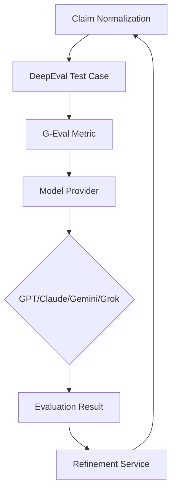

## What is DeepEval?

DeepEval is an open-source evaluation framework for Large Language Models (LLMs) created by Confident AI. It provides tools for testing, evaluating, and improving LLM applications using both traditional metrics and LLM-based evaluation.

<Info>
  **DeepEval** by Confident AI
  
  **Purpose**: Unit testing and evaluation framework for LLM outputs
  
  **Key Features**:
  - G-Eval and other LLM-based metrics
  - Support for multiple LLM providers (OpenAI, Anthropic, Google, xAI)
  - Test case management and evaluation tracking
  - Integration with popular frameworks (LangChain, LlamaIndex)
  
  **Repository**: [github.com/confident-ai/deepeval](https://github.com/confident-ai/deepeval)
</Info>

## Why DeepEval in CheckThat AI?

CheckThat AI uses DeepEval as its evaluation infrastructure for several reasons:

### Core Benefits

<Note>
  **DeepEval Advantages**:
  
  1. **Multi-Provider Support**: Evaluate with GPT-4, Claude, Gemini, or Grok
  2. **G-Eval Implementation**: Built-in support for advanced LLM-based evaluation
  3. **Test Case Management**: Structured approach to evaluation scenarios
  4. **Custom Metrics**: Extensible framework for domain-specific evaluation
  5. **Tracing and Observability**: Track evaluation history and refinement loops
  6. **Production-Ready**: Robust error handling and async support
</Note>

## Architecture Overview

CheckThat AI's DeepEval integration consists of three main components:



## Core Components

### 1. DeepEval Model Wrapper

The `DeepEvalModel` class abstracts model provider selection:

```python
# From /api/_utils/deepeval_model.py

from deepeval.models import GPTModel, AnthropicModel, GeminiModel, GrokModel

class DeepEvalModel:
    def __init__(self, model: str, api_key: str):
        self.model = model
        self.api_key = api_key
        
        # Determine provider from model name
        if model in OPENAI_MODELS:
            self.api_provider = 'OPENAI'
        elif model in xAI_MODELS:
            self.api_provider = 'XAI'
        elif model in ANTHROPIC_MODELS:
            self.api_provider = 'ANTHROPIC'
        elif model in GEMINI_MODELS:
            self.api_provider = 'GEMINI'
        else:
            self.api_provider = 'OPENAI'  # Default
    
    def getEvalModel(self):
        """Return appropriate DeepEval model instance."""
        if self.api_provider == 'OPENAI':
            try:
                return GPTModel(
                    model=self.model,
                    _openai_api_key=self.api_key
                )
            except ValueError:
                # Fallback for unknown GPT models
                return GPTModel(
                    model="gpt-4o",
                    _openai_api_key=self.api_key
                )
                
        elif self.api_provider == 'ANTHROPIC':
            return AnthropicModel(
                model=self.model,
                _anthropic_api_key=self.api_key
            )
            
        elif self.api_provider == 'GEMINI':
            return GeminiModel(
                model=self.model,
                api_key=self.api_key
            )
            
        elif self.api_provider == 'XAI':
            return GrokModel(
                model=self.model,
                api_key=self.api_key
            )
```

**Usage**:
```python
from api._utils.deepeval_model import DeepEvalModel

# Create wrapper
wrapper = DeepEvalModel(
    model="gpt-4o",
    api_key="sk-..."
)

# Get DeepEval model instance
eval_model = wrapper.getEvalModel()
```

### 2. G-Eval Metric Configuration

CheckThat AI defines evaluation criteria in `STATIC_EVAL_SPECS`:

```python
# From /api/types/evals.py:25-50

from pydantic import BaseModel, Field
from typing import List

class StaticEvaluation(BaseModel):
    criteria: str = Field(description="Evaluation criteria")
    evaluation_steps: List[str] = Field(description="Steps to evaluate")

STATIC_EVAL_SPECS = StaticEvaluation(
    criteria="""Evaluate the normalized claim against the following 
    criteria: Verifiability and Self-Containment, Claim Centrality 
    and Extraction Quality, Conciseness and Clarity, Check-Worthiness 
    Alignment, and Factual Consistency""",
    
    evaluation_steps=[
        # Verifiability and Self-Containment
        "Check if the claim contains verifiable factual assertions 
         that can be independently checked",
        "Check if the claim is self-contained without requiring 
         additional context from the original post",
        
        # Claim Centrality and Extraction Quality
        "Check if the normalized claim captures the central assertion 
         from the source text while removing extraneous information",
        "Check if the claim represents the core factual assertion 
         that requires fact-checking, not peripheral details",
        
        # Conciseness and Clarity
        "Check if the claim is presented in a straightforward, 
         concise manner that fact-checkers can easily process",
        "Check if the claim is significantly shorter than source 
         posts while preserving essential meaning",
        
        # Check-Worthiness Alignment
        "Check if the normalized claim meets check-worthiness 
         standards for fact-verification",
        "Check if the claim has general public interest, potential 
         for harm, and likelihood of being false",
        
        # Factual Consistency
        "Check if the normalized claim is factually consistent 
         with the source material without hallucinations or distortions",
        "Check if the claim accurately reflects the original 
         assertion without introducing new information",
    ]
)
```

### 3. Refinement Service

The `RefinementService` orchestrates evaluation and iterative improvement:

```python
# From /api/services/refinement/refine.py:46-185

from concurrent.futures import ThreadPoolExecutor
from deepeval import evaluate
from deepeval.metrics import GEval
from deepeval.test_case import LLMTestCase, LLMTestCaseParams

# Thread pool for DeepEval (avoids uvloop conflicts)
_executor = ThreadPoolExecutor(max_workers=4)

def _run_evaluation_in_thread(test_case: LLMTestCase, metric: BaseMetric):
    """
    Run DeepEval in separate thread to avoid event loop conflicts.
    
    FastAPI uses uvloop, but DeepEval creates its own event loop.
    Running in a thread pool isolates the loop creation.
    """
    return evaluate(test_cases=[test_case], metrics=[metric])

class RefinementService:
    def __init__(
        self, 
        model: Union[GPTModel, GeminiModel, AnthropicModel, GrokModel],
        threshold: float = 0.5,
        max_iters: int = 3,
        metrics: Optional[List[str]] = None
    ):
        self.model = model
        self.threshold = threshold
        self.max_iters = max_iters
        self.metrics = metrics
    
    def refine_single_claim(
        self,
        original_query: str,
        current_claim: str,
        client: ModelClient,
        original_response: Optional[Any] = None
    ) -> Tuple[Any, List[RefinementHistory]]:
        """
        Iteratively refine claim using G-Eval feedback.
        """
        refinement_history = []
        current_response = original_response
        
        try:
            # Create G-Eval metric
            if self.metrics is None:
                eval_metric = GEval(
                    name="Claim Quality Assessment",
                    criteria=STATIC_EVAL_SPECS.criteria,
                    evaluation_params=[
                        LLMTestCaseParams.INPUT,
                        LLMTestCaseParams.ACTUAL_OUTPUT
                    ],
                    model=self.model,
                    threshold=self.threshold
                )
            else:
                eval_metric = self.metrics
                eval_metric.model = self.model
                eval_metric.threshold = self.threshold
            
            # Evaluate initial claim
            test_case = LLMTestCase(
                input=original_query,
                actual_output=current_claim
            )
            
            # Run evaluation in thread (avoid uvloop conflict)
            future = _executor.submit(
                _run_evaluation_in_thread,
                test_case,
                eval_metric
            )
            eval_result = future.result()  # Blocking
            
            original_score = eval_result.test_results[0].metrics_data[0].score
            original_feedback = eval_result.test_results[0].metrics_data[0].reason
            
            refinement_history.append(RefinementHistory(
                claim_type=ClaimType.ORIGINAL,
                claim=current_claim,
                score=original_score,
                feedback=original_feedback
            ))
            
            # If threshold met, return
            if original_score >= self.threshold:
                return current_response, refinement_history
            
            # Refinement loop
            for i in range(self.max_iters):
                # Generate refinement prompt
                refine_user_prompt = f"""
                ## Original Query
                {original_query}
                
                ## Current Response
                {current_claim}
                
                ## Feedback
                {eval_result.test_results[0].metrics_data[0].reason}
                
                ## Task
                Refine the current response based on the feedback.
                """
                
                # Call model to refine
                refined_response = client.generate_response(
                    user_prompt=refine_user_prompt,
                    sys_prompt=refine_sys_prompt
                )
                refined_claim = refined_response.choices[0].message.content
                
                # Update state
                current_claim = refined_claim
                current_response = refined_response
                
                # Re-evaluate
                test_case = LLMTestCase(
                    input=original_query,
                    actual_output=refined_claim
                )
                
                future = _executor.submit(
                    _run_evaluation_in_thread,
                    test_case,
                    eval_metric
                )
                eval_result = future.result()
                
                score = eval_result.test_results[0].metrics_data[0].score
                feedback_text = eval_result.test_results[0].metrics_data[0].reason
                
                refinement_history.append(RefinementHistory(
                    claim_type=ClaimType.REFINED,
                    claim=refined_claim,
                    score=score,
                    feedback=feedback_text
                ))
                
                # Check if threshold met
                if score >= self.threshold:
                    break
            
            # Mark final claim
            if refinement_history:
                refinement_history[-1].claim_type = ClaimType.FINAL
            
            return current_response, refinement_history
            
        except Exception as e:
            logger.warning(f"Refinement failed: {e}")
            error_history = RefinementHistory(
                claim_type=ClaimType.FINAL,
                claim=current_claim,
                score=0.0,
                feedback=f"Refinement failed: {str(e)}"
            )
            return current_response or original_response, [error_history]
```

## Test Case Structure

DeepEval uses `LLMTestCase` objects to structure evaluation:

### Basic Test Case

```python
from deepeval.test_case import LLMTestCase, LLMTestCaseParams

test_case = LLMTestCase(
    input="Original social media post...",
    actual_output="Normalized claim...",
    expected_output="Reference claim...",  # Optional
    retrieval_context=[]                    # Optional
)
```

### Test Case Parameters

```python
# Available parameters for evaluation
from deepeval.test_case import LLMTestCaseParams

LLMTestCaseParams.INPUT            # Original input text
LLMTestCaseParams.ACTUAL_OUTPUT    # Generated output
LLMTestCaseParams.EXPECTED_OUTPUT  # Reference output
LLMTestCaseParams.RETRIEVAL_CONTEXT # Background information
LLMTestCaseParams.CONTEXT          # Additional context
```

### Example: Claim Evaluation

```python
original_post = """
BREAKING: Scientists at MIT have discovered a cure for cancer 
using AI!!! This will save millions of lives! 🎉 #Science #AI
"""

normalized_claim = """
MIT researchers developed an AI system that aids in cancer treatment
"""

reference_claim = """
MIT scientists created AI tool for cancer diagnosis assistance
"""

# Create test case
test_case = LLMTestCase(
    input=original_post,
    actual_output=normalized_claim,
    expected_output=reference_claim
)

# Evaluate
metric = GEval(
    name="Claim Quality",
    criteria=STATIC_EVAL_SPECS.criteria,
    evaluation_params=[
        LLMTestCaseParams.INPUT,
        LLMTestCaseParams.ACTUAL_OUTPUT
    ],
    model=eval_model,
    threshold=0.7
)

metric.measure(test_case)

print(f"Score: {metric.score}")
print(f"Feedback: {metric.reason}")
```

## Custom Metrics

You can create domain-specific evaluation metrics:

### Example: Scientific Accuracy Metric

```python
from deepeval.metrics import GEval

scientific_accuracy = GEval(
    name="Scientific Accuracy Assessment",
    criteria="""Evaluate whether the claim accurately represents 
    scientific findings without overstatement or misrepresentation""",
    evaluation_steps=[
        "Check if the claim distinguishes correlation from causation",
        "Verify the claim doesn't overstate confidence (e.g., 'proves' vs 'suggests')",
        "Assess if the claim acknowledges study limitations",
        "Confirm the claim doesn't generalize beyond study scope",
        "Ensure technical terms are used accurately"
    ],
    evaluation_params=[
        LLMTestCaseParams.INPUT,
        LLMTestCaseParams.ACTUAL_OUTPUT
    ],
    model=eval_model,
    threshold=0.75
)
```

### Example: Check-Worthiness Metric

```python
check_worthiness = GEval(
    name="Check-Worthiness Assessment",
    criteria="""Evaluate the importance and urgency of fact-checking 
    this claim based on potential harm, public interest, and 
    likelihood of being false""",
    evaluation_steps=[
        "Assess potential harm if the claim is false",
        "Consider the claim's reach and influence potential",
        "Evaluate public interest in the claim's veracity",
        "Determine if the claim could mislead vulnerable populations",
        "Assess the claim's novelty (not already fact-checked)"
    ],
    evaluation_params=[
        LLMTestCaseParams.INPUT,
        LLMTestCaseParams.ACTUAL_OUTPUT
    ],
    model=eval_model,
    threshold=0.6
)
```

## Async Event Loop Handling

### The uvloop Problem

FastAPI uses uvloop for async operations, but DeepEval's `evaluate()` function creates its own event loop internally. This causes conflicts:

```python
# ❌ This fails in FastAPI
@app.post("/evaluate")
async def evaluate_claim(claim: str):
    metric.measure(test_case)
    # RuntimeError: Cannot run the event loop while another loop is running
```

### Solution: Thread Pool Execution

CheckThat AI runs DeepEval in a separate thread:

```python
from concurrent.futures import ThreadPoolExecutor

# Create thread pool at module level
_executor = ThreadPoolExecutor(max_workers=4)

def _run_evaluation_in_thread(test_case, metric):
    """Run DeepEval in isolated thread."""
    return evaluate(test_cases=[test_case], metrics=[metric])

# Use in FastAPI endpoint
@app.post("/evaluate")
async def evaluate_claim(claim: str):
    # Submit to thread pool
    future = _executor.submit(
        _run_evaluation_in_thread,
        test_case,
        metric
    )
    
    # Await result (blocks current thread, not event loop)
    result = future.result()
    
    return {"score": result.test_results[0].metrics_data[0].score}
```

**Implementation**: `/api/services/refinement/refine.py:34-44`

## Evaluation Service

CheckThat AI also provides a standalone evaluation service:

```python
# From /api/services/evaluation/evaluate.py

from deepeval.tracing import observe

@observe(name="claim_evaluation_service")
def evaluate_claims_service(
    response: Any,
    config: Dict[str, Any]
) -> Tuple[Any, Optional[EvaluationReport]]:
    """
    Evaluate normalized claims using custom metrics.
    """
    try:
        # Get metrics to use
        metrics_to_use = config.get('metrics', [])
        if not metrics_to_use:
            return response, None
        
        # Extract content
        content = response.choices[0].message.content
        
        # Create evaluation model
        model_name = config.get('model', 'gpt-3.5-turbo')
        api_key = config.get('api_key')
        
        wrapper = DeepEvalModel(model=model_name, api_key=api_key)
        eval_model = wrapper.getEvalModel()
        
        # Create metrics
        evaluation_metrics = create_evaluation_metrics(
            metrics_to_use,
            eval_model
        )
        
        # Run evaluations
        detailed_results = evaluate_text_with_metrics(
            content,
            evaluation_metrics
        )
        
        # Create report
        evaluation_report = EvaluationReport(
            metrics_used=list(detailed_results.keys()),
            scores={name: result.get('score', 0.0) 
                   for name, result in detailed_results.items()},
            detailed_results=detailed_results,
            timestamp=datetime.utcnow().isoformat(),
            model_info={
                "model_name": model_name,
                "evaluation_model": eval_model.get_model_name()
            }
        )
        
        return response, evaluation_report
        
    except Exception as e:
        logger.error(f"Evaluation failed: {e}")
        return response, None
```

## Observability and Tracing

DeepEval provides tracing for monitoring evaluations:

```python
from deepeval.tracing import observe

@observe(name="claim_normalization")
def normalize_claim(post: str) -> str:
    """Normalize claim with tracing."""
    claim = model.generate(post)
    return claim

@observe(name="claim_evaluation")
def evaluate_claim(claim: str) -> float:
    """Evaluate claim with tracing."""
    metric.measure(test_case)
    return metric.score
```

Traces can be viewed in the DeepEval dashboard (requires Confident AI account).

## Production Considerations

### Error Handling

Robust error handling for evaluation failures:

```python
try:
    eval_result = evaluate(
        test_cases=[test_case],
        metrics=[metric]
    )
    score = eval_result.test_results[0].metrics_data[0].score
except Exception as e:
    logger.error(f"Evaluation failed: {e}")
    # Fallback: use original claim without refinement
    score = 0.0
    feedback = f"Evaluation error: {str(e)}"
```

### Rate Limiting

Handle API rate limits gracefully:

```python
import time
from openai import RateLimitError

def evaluate_with_retry(test_case, metric, max_retries=3):
    for attempt in range(max_retries):
        try:
            metric.measure(test_case)
            return metric.score
        except RateLimitError:
            if attempt < max_retries - 1:
                wait_time = 2 ** attempt  # Exponential backoff
                logger.warning(f"Rate limited. Retrying in {wait_time}s...")
                time.sleep(wait_time)
            else:
                raise
```

### Cost Optimization

<Info>
  **Cost-Saving Strategies**:
  
  1. **Use smaller models**: Gemini Flash is 10x cheaper than GPT-4
  2. **Cache evaluations**: Store scores for identical inputs
  3. **Selective refinement**: Only refine low-scoring claims
  4. **Batch processing**: Evaluate multiple claims in parallel
  5. **Threshold tuning**: Higher threshold = fewer refinement iterations
</Info>

## API Integration

### REST API Usage

CheckThat AI exposes refinement via API:

```bash
curl -X POST "https://api.checkthat.ai/chat" \
  -H "Content-Type: application/json" \
  -d '{
    "user_query": "COVID vaccines developed in only 10 months!!",
    "model": "gpt-4o",
    "refine_claims": true,
    "refine_threshold": 0.7,
    "refine_max_iters": 3,
    "refine_metrics": null,
    "checkthat_api_key": "your-api-key"
  }'
```

**Response**:
```json
{
  "id": "chatcmpl-...",
  "choices": [{
    "message": {
      "content": "COVID-19 mRNA vaccines from Pfizer and Moderna were developed in approximately 10 months"
    }
  }],
  "refinement_metadata": {
    "metric_used": "Claim Quality Assessment",
    "threshold": 0.7,
    "refinement_model": "gpt-4o",
    "refinement_history": [
      {
        "claim_type": "original",
        "claim": "COVID vaccines developed in 10 months",
        "score": 0.65,
        "feedback": "Needs more specificity..."
      },
      {
        "claim_type": "refined",
        "claim": "COVID-19 mRNA vaccines developed in 10 months",
        "score": 0.78,
        "feedback": "Good improvement..."
      },
      {
        "claim_type": "final",
        "claim": "COVID-19 mRNA vaccines from Pfizer and Moderna were developed in approximately 10 months",
        "score": 0.87,
        "feedback": "Excellent claim quality"
      }
    ]
  }
}
```

## References

### Documentation

- **DeepEval Docs**: [docs.confident-ai.com](https://docs.confident-ai.com/)
- **GitHub Repository**: [github.com/confident-ai/deepeval](https://github.com/confident-ai/deepeval)
- **G-Eval Paper**: "G-Eval: NLG Evaluation using GPT-4 with Better Human Alignment" (Liu et al., 2023)

### Implementation Files

- **DeepEval Wrapper**: `/api/_utils/deepeval_model.py`
- **Refinement Service**: `/api/services/refinement/refine.py`
- **Evaluation Service**: `/api/services/evaluation/evaluate.py`
- **Evaluation Specs**: `/api/types/evals.py`

### Related Documentation

- [G-Eval Framework](/research/g-eval)
- [Fact-Checking Pipeline](/research/fact-checking)
- [Claim Detection](/research/claim-detection)
- [METEOR Scoring](/research/meteor-scoring)
