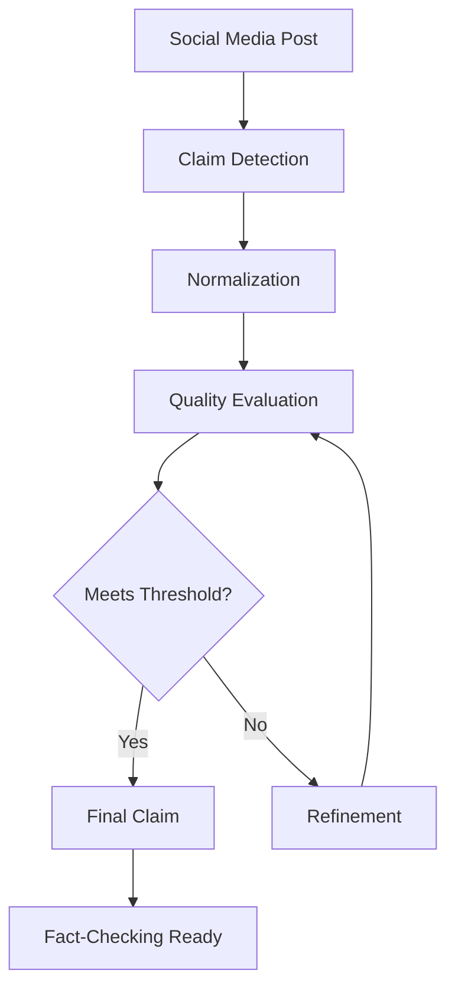

## Overview

CheckThat AI implements a comprehensive fact-checking pipeline that transforms noisy social media posts into verified, normalized claims ready for fact-checking. The pipeline integrates multiple stages of processing, evaluation, and refinement.

## Pipeline Architecture

The complete fact-checking workflow consists of six interconnected stages:



## Stage 1: Input Processing

### Noisy Social Media Posts

The pipeline begins with unstructured text from social media platforms:

<Info>
  **Typical Input Characteristics**:
  - Informal language and slang
  - Grammatical errors and typos
  - Hashtags, URLs, and mentions
  - Emojis and special characters
  - Incomplete sentences
  - Emotional or inflammatory language
  - Ambiguous references ("they", "this", "it")
</Info>

**Example Input**:
```
They're hiding the TRUTH about vaccines!!! 💉😱 
Wake up sheeple! #BigPharma #Conspiracy 
More info: bit.ly/xyz123
```

## Stage 2: Claim Detection

The system identifies verifiable assertions within the noisy text.

See [Claim Detection](/research/claim-detection) for detailed methodology.

### Detection Process

1. **Sentence Segmentation**: Split post into individual sentences
2. **Context Analysis**: Establish relationships between sentences
3. **Verifiability Assessment**: Identify which parts can be fact-checked
4. **Claim Extraction**: Pull out factual assertions

**After Detection**:
```
Core Claim: "Vaccines contain hidden ingredients"
```

## Stage 3: Claim Normalization

### Normalization Goals

Transform detected claims into standardized form:

<Note>
  **Normalization Objectives**:
  1. **Self-contained**: Understandable without context
  2. **Concise**: Typically under 25 words
  3. **Clear**: Unambiguous language
  4. **Verifiable**: Can be fact-checked
  5. **Faithful**: Preserves original meaning
</Note>

### Multi-Model Approach

CheckThat AI supports multiple AI models for normalization:

| Provider | Models | Use Case |
|----------|--------|----------|
| **OpenAI** | GPT-4o, GPT-4.1 | High-quality reasoning and context understanding |
| **Anthropic** | Claude 3.7 Sonnet | Strong performance on ambiguity resolution |
| **Google** | Gemini 2.5 Pro, Flash | Fast processing with good accuracy |
| **Meta** | Llama 3.3 70B | Open-source alternative, free tier available |
| **xAI** | Grok 3 | Alternative perspective on claim interpretation |

### Prompting Strategies

Different approaches for different scenarios:

#### Zero-Shot

Direct instruction without examples:

```python
user_prompt = f"""
Identify the decontextualized, stand-alone, 
and verifiable central claim in the given post: {post}
"""
```

**Best for**: Clear, straightforward posts

#### Few-Shot

Provide examples to guide the model (5 examples in production):

```python
user_prompt = f"""
Here are examples of claim normalization:

Example 1:
Post: [EXAMPLE POST]
Claim: [NORMALIZED CLAIM]

...

Now normalize: {post}
"""
```

**Best for**: Complex posts requiring pattern matching

#### Chain-of-Thought (CoT)

Step-by-step reasoning process:

```python
user_prompt = f"""
Normalize this post step by step:
1. Identify the actor
2. Find the action
3. Extract evidence
4. Formulate claim

Post: {post}
"""
```

**Best for**: Posts with multiple embedded claims

**After Normalization**:
```
Normalized Claim: "Pharmaceutical companies conceal vaccine ingredients from the public"
```

## Stage 4: Quality Evaluation

### Automated Assessment

The system evaluates normalized claims using multiple metrics:

#### G-Eval Framework

LLM-based evaluation with specific criteria (see [G-Eval](/research/g-eval)):

```python
from deepeval.metrics import GEval
from deepeval.test_case import LLMTestCase

metric = GEval(
    name="Claim Quality Assessment",
    criteria="""Evaluate the normalized claim against:
    - Verifiability and Self-Containment
    - Claim Centrality and Extraction Quality
    - Conciseness and Clarity
    - Check-Worthiness Alignment
    - Factual Consistency""",
    evaluation_params=[INPUT, ACTUAL_OUTPUT],
    model=evaluator_model,
    threshold=0.5
)

test_case = LLMTestCase(
    input=original_post,
    actual_output=normalized_claim
)

metric.measure(test_case)
score = metric.score  # 0.0 to 1.0
```

**Implementation**: `/home/daytona/workspace/source/api/services/refinement/refine.py:76-108`

#### METEOR Score

When reference claims are available (competition datasets):

```python
from nltk.translate.meteor_score import meteor_score

score = meteor_score(
    [reference_claim.split()],
    normalized_claim.split()
)
```

See [METEOR Scoring](/research/meteor-scoring) for details.

**Evaluation Results**:
```json
{
  "score": 0.72,
  "feedback": "Claim is verifiable but could be more specific...",
  "passes_threshold": true
}
```

## Stage 5: Refinement Loop

### Iterative Improvement

If the claim doesn't meet quality thresholds, the system enters a refinement loop:

<Info>
  **Refinement Process** (`RefinementService` in refine.py:46-185):
  
  1. **Evaluate**: Score the current claim
  2. **Generate Feedback**: Identify specific weaknesses
  3. **Refine**: Create improved version
  4. **Re-evaluate**: Check if quality improved
  5. **Iterate**: Repeat up to `max_iters` times (default: 3)
  6. **Terminate**: When threshold met or max iterations reached
</Info>

### Refinement Service Implementation

```python
class RefinementService:
    def __init__(self, model, threshold=0.5, max_iters=3):
        self.model = model
        self.threshold = threshold
        self.max_iters = max_iters
    
    def refine_single_claim(
        self, 
        original_query: str,
        current_claim: str,
        client: ModelClient
    ) -> Tuple[Response, List[RefinementHistory]]:
        """
        Iteratively refine claim using G-Eval feedback.
        
        Returns:
            - Final response object
            - History of refinement iterations
        """
        refinement_history = []
        
        for i in range(self.max_iters):
            # Evaluate current claim
            eval_result = self._evaluate_claim(
                original_query, 
                current_claim
            )
            
            score = eval_result.score
            feedback = eval_result.reason
            
            refinement_history.append({
                "iteration": i,
                "claim": current_claim,
                "score": score,
                "feedback": feedback
            })
            
            # Check if threshold met
            if score >= self.threshold:
                break
            
            # Generate refined version
            refine_prompt = self._create_refine_prompt(
                original_query,
                current_claim,
                feedback
            )
            
            current_claim = client.generate_response(
                user_prompt=refine_prompt,
                sys_prompt=refine_sys_prompt
            )
        
        return current_claim, refinement_history
```

### Self-Refine vs Cross-Refine

#### Self-Refine

Same model refines its own output:

```python
# GPT-4 generates initial claim
initial = gpt4.normalize(post)

# GPT-4 refines its own claim
refined = gpt4.refine(initial, feedback)
```

**Advantages**: Consistent style, lower cost
**Disadvantages**: May repeat same errors

#### Cross-Refine

Different model refines another model's output:

```python
# GPT-4 generates initial claim
initial = gpt4.normalize(post)

# Claude refines GPT-4's claim
refined = claude.refine(initial, feedback)
```

**Advantages**: Different perspective, error correction
**Disadvantages**: Higher cost, potential style mismatch

**Refinement Results**:
```json
{
  "iterations": 2,
  "final_score": 0.85,
  "final_claim": "Major pharmaceutical companies do not publicly disclose complete lists of vaccine ingredients",
  "history": [
    {"iteration": 0, "score": 0.72, "claim": "..."},
    {"iteration": 1, "score": 0.85, "claim": "..."}
  ]
}
```

## Stage 6: Source Verification

### Fact-Checking Integration

Once a high-quality normalized claim is produced, it's ready for fact-checking:

<Note>
  **Verification Process** (external to CheckThat AI):
  
  1. **Source Discovery**: Find relevant sources (news, scientific papers, databases)
  2. **Evidence Extraction**: Pull supporting or refuting evidence
  3. **Credibility Assessment**: Evaluate source reliability
  4. **Verdict Determination**: Conclude true/false/partially true/unverifiable
  5. **Explanation Generation**: Document reasoning and sources
</Note>

### Check-Worthiness Filtering

Before verification, assess if the claim warrants fact-checking:

```python
from deepeval.metrics import GEval

check_worthiness_metric = GEval(
    name="Check-Worthiness Assessment",
    criteria="""Evaluate the importance of fact-checking 
    this claim based on:
    - Potential harm if false
    - Public interest
    - Viral spread potential
    - Impact on vulnerable populations""",
    evaluation_params=[INPUT, ACTUAL_OUTPUT],
    model=evaluator_model,
    threshold=0.6
)
```

**High Check-Worthiness Claims**:
- Health/medical advice
- Election information
- Safety warnings
- Financial claims
- Policy announcements

**Low Check-Worthiness Claims**:
- Personal anecdotes
- Clearly satirical content
- Subjective preferences
- Already debunked claims

## Complete Pipeline Example

### End-to-End Processing

**Input**:
```
COVID vaccines were developed in only 10 months!! 😱 
Normally takes 10+ YEARS to develop a safe vaccine.
They're experimenting on us! #NoVax #Truth
```

**Stage 1: Detection**
```
Claims detected:
1. "COVID vaccines were developed in only 10 months"
2. "Normal vaccine development takes 10+ years"
3. "COVID vaccines are experimental"
```

**Stage 2: Normalization**
```
Priority claim (most central):
"COVID-19 vaccines were developed in 10 months compared 
to typical vaccine development timeline of 10+ years"
```

**Stage 3: Evaluation** (Initial)
```json
{
  "score": 0.68,
  "feedback": "Claim is factually accurate but lacks context 
              about accelerated development reasons. 
              Could be more specific about which vaccines."
}
```

**Stage 4: Refinement** (Iteration 1)
```
Refined claim:
"COVID-19 mRNA vaccines from Pfizer and Moderna were 
developed in approximately 10 months, significantly 
faster than the typical 10-15 year vaccine development 
timeline"
```

**Stage 5: Re-evaluation**
```json
{
  "score": 0.89,
  "feedback": "Excellent claim with specific details and 
              proper context. Highly verifiable.",
  "passes_threshold": true
}
```

**Stage 6: Check-Worthiness**
```json
{
  "check_worthiness_score": 0.92,
  "priority": "HIGH",
  "reasoning": "Health-related claim with high public 
               interest and potential impact on 
               vaccination decisions"
}
```

## Integration with CheckThat AI

### API Usage

#### Single Claim Processing

```bash
curl -X POST "https://api.checkthat.ai/chat" \
  -H "Content-Type: application/json" \
  -d '{
    "user_query": "COVID vaccines developed in only 10 months!!",
    "model": "gpt-4o",
    "refine_claims": true,
    "refine_threshold": 0.8,
    "refine_max_iters": 3
  }'
```

#### Batch Processing

```bash
curl -X POST "https://api.checkthat.ai/evaluate" \
  -H "Content-Type: application/json" \
  -d '{
    "dataset": "dev.csv",
    "model": "gpt-4o",
    "prompt_style": "Few-shot-CoT",
    "refine_iterations": 2
  }'
```

### Web Application

The CheckThat AI web interface provides:

- **Interactive Chat**: Real-time claim normalization with streaming
- **Batch Evaluation**: Upload CSV datasets for bulk processing
- **Model Comparison**: Test multiple models simultaneously
- **Refinement Tracking**: Visualize improvement across iterations
- **METEOR Scoring**: Automatic quality assessment

**Live Demo**: [https://nikhil-kadapala.github.io/clef2025-checkthat-lab-task2/](https://nikhil-kadapala.github.io/clef2025-checkthat-lab-task2/)

## Performance Considerations

### Latency

| Stage | Typical Latency | Notes |
|-------|----------------|-------|
| Detection | ~500ms | Depends on post length |
| Normalization | 2-5s | Model-dependent |
| Evaluation | 3-8s | G-Eval requires LLM call |
| Refinement (per iteration) | 5-13s | Normalization + evaluation |
| **Total** | **10-30s** | With 0-2 refinement iterations |

### Cost Optimization

<Info>
  **Cost-Saving Strategies**:
  
  1. **Free Tier Models**: Use Llama 3.3 70B via Together.ai (no API key required)
  2. **Selective Refinement**: Only refine claims below threshold
  3. **Early Stopping**: Terminate refinement when score plateaus
  4. **Batch Processing**: Process multiple claims in parallel
  5. **Caching**: Store normalized claims to avoid reprocessing
</Info>

## Evaluation Metrics

### System Performance

The complete pipeline is evaluated using:

1. **METEOR Score**: Measures semantic similarity to reference claims (competition metric)
2. **G-Eval Score**: Assesses quality across multiple dimensions
3. **Human Evaluation**: Expert judgment on claim quality
4. **Convergence Rate**: Percentage of claims meeting threshold
5. **Iteration Efficiency**: Average refinement iterations required

See [G-Eval](/research/g-eval) and [METEOR Scoring](/research/meteor-scoring) for details.

## References

### Implementation Files

- **Refinement Service**: `/api/services/refinement/refine.py`
- **Evaluation Service**: `/api/services/evaluation/evaluate.py`
- **Prompts**: `/api/_utils/prompts.py`
- **DeepEval Integration**: `/api/_utils/deepeval_model.py`

### Related Documentation

- [CLEF-CheckThat! Lab Overview](/research/clef-checkthat)
- [Claim Detection Methodology](/research/claim-detection)
- [G-Eval Framework](/research/g-eval)
- [METEOR Scoring](/research/meteor-scoring)
- [DeepEval Integration](/research/deepeval-integration)

### Academic References

- CLEF-CheckThat! Lab proceedings and datasets
- G-Eval: "G-Eval: NLG Evaluation using GPT-4 with Better Human Alignment" (Liu et al., 2023)
- METEOR: "METEOR: An Automatic Metric for MT Evaluation" (Banerjee & Lavie, 2005)
