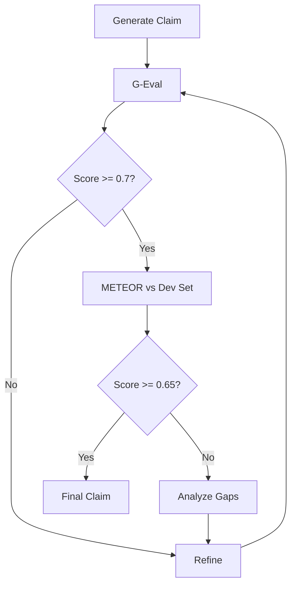

## What is METEOR?

METEOR (Metric for Evaluation of Translation with Explicit ORdering) is an automatic evaluation metric originally designed for machine translation. In CheckThat AI, METEOR is used to measure the quality of normalized claims by comparing them against reference claims.

### Research Background

<Info>
  **Paper**: "METEOR: An Automatic Metric for MT Evaluation with Improved Correlation with Human Judgments"
  
  **Authors**: Satanjeev Banerjee and Alon Lavie
  
  **Publication**: ACL Workshop on Intrinsic and Extrinsic Evaluation Measures for MT and Summarization (2005)
  
  **Key Innovation**: Unlike BLEU which only considers precision, METEOR balances precision and recall, and incorporates stemming, synonymy, and paraphrasing.
</Info>

## Why METEOR for Claim Evaluation?

The CLEF-CheckThat! Lab uses METEOR as the primary evaluation metric for Task 2 (2025) because it aligns well with claim normalization requirements:

### Advantages for Claims

<Note>
  **METEOR Benefits**:
  
  1. **Semantic Matching**: Recognizes synonyms and paraphrases
     - "automobile" ≈ "car"
     - "physician" ≈ "doctor"
  
  2. **Recall-Oriented**: Rewards capturing all important content
     - Doesn't penalize adding necessary context
  
  3. **Stemming**: Handles morphological variations
     - "running", "runs", "ran" → "run"
  
  4. **Word Order**: Considers phrase structure
     - "The dog bit the man" ≠ "The man bit the dog"
  
  5. **Balanced**: Combines precision and recall harmonically
</Note>

### Comparison with Other Metrics

| Metric | Precision | Recall | Synonyms | Word Order | Best For |
|--------|-----------|--------|----------|------------|----------|
| **BLEU** | ✅ | ❌ | ❌ | ✅ | Translation adequacy |
| **ROUGE** | ❌ | ✅ | ❌ | ❌ | Summarization coverage |
| **Exact Match** | ✅ | ✅ | ❌ | ✅ | Strict equality |
| **METEOR** | ✅ | ✅ | ✅ | ✅ | Semantic similarity |
| **G-Eval** | ✅ | ✅ | ✅ | ✅ | Nuanced evaluation |

## METEOR Calculation

### Algorithm Overview

METEOR computes alignment between candidate and reference text through multiple stages:

```python
from nltk.translate.meteor_score import meteor_score

# Example usage
reference = ["The FDA approved COVID-19 vaccine for children aged 5 to 11".split()]
candidate = "FDA approves COVID vaccine for kids ages 5-11".split()

score = meteor_score(reference, candidate)
print(f"METEOR Score: {score:.4f}")  # Range: 0.0 to 1.0
```

### Step 1: Alignment

METEOR creates alignment between words in stages:

#### Stage 1: Exact Match
```
Reference: The FDA approved COVID-19 vaccine for children aged 5 to 11
Candidate: FDA approves COVID vaccine for kids ages 5-11
           ^^^ ^^^^^^^ ^^^^^ ^^^^^^^ ^^^ ^^^^ ^^ ^^ ^^
Exact:     FDA         COVID vaccine            5    11
```

#### Stage 2: Stem Match
```
Reference: approved
Candidate: approves
Stem:      approv* → MATCH
```

#### Stage 3: Synonym Match
```
Reference: children
Candidate: kids
WordNet:   children ≈ kids → MATCH
```

#### Stage 4: Paraphrase Match
```
Reference: aged 5 to 11
Candidate: ages 5-11
Paraphrase: Similar phrasing → MATCH
```

### Step 2: Precision and Recall

After alignment:

```python
# Count matched words
matches = count_aligned_words()

# Precision: What portion of candidate words matched?
precision = matches / len(candidate_words)

# Recall: What portion of reference words matched?
recall = matches / len(reference_words)
```

**Example**:
```
Reference: "The FDA approved COVID-19 vaccine for children aged 5 to 11" (11 words)
Candidate: "FDA approves COVID vaccine for kids ages 5-11" (9 words)
Matches: 9 (including stems/synonyms)

Precision = 9 / 9 = 1.00 (all candidate words matched)
Recall = 9 / 11 = 0.82 (missed "The" and "to")
```

### Step 3: F-mean

METEOR uses harmonic mean with recall weighted higher:

```python
# METEOR weights recall more heavily
alpha = 0.9  # Standard value

# Harmonic mean
if precision > 0 and recall > 0:
    f_mean = (10 * precision * recall) / (recall + alpha * precision)
else:
    f_mean = 0
```

### Step 4: Fragmentation Penalty

Penalize discontinuous alignments:

```
Good alignment (continuous):
Reference: The cat sat on the mat
Candidate: cat sat on mat
           ^^^^^^^^^^^^^^^^^ (1 chunk)

Bad alignment (fragmented):
Reference: The cat sat on the mat  
Candidate: mat on sat cat
           ^^^ ^^ ^^^ ^^^ (4 chunks)
```

```python
# Count alignment chunks
chunks = count_contiguous_alignment_chunks()

# Calculate penalty
fragmentation = chunks / matches
penalty = 0.5 * (fragmentation ** 3)

# Final score
meteor_score = f_mean * (1 - penalty)
```

## Score Interpretation

METEOR scores range from **0.0** to **1.0**:

### Score Ranges

<Info>
  **METEOR Score Interpretation**:
  
  - **0.90-1.00**: Near-perfect match (rare in claim normalization)
  - **0.80-0.89**: Excellent semantic similarity
  - **0.70-0.79**: Good match with minor differences
  - **0.60-0.69**: Moderate similarity, key content preserved
  - **0.50-0.59**: Fair match, some important content differs
  - **0.40-0.49**: Poor match, significant differences
  - **0.00-0.39**: Very poor match, mostly unrelated
</Info>

### CLEF-CheckThat! Benchmarks

Competition baselines and winning systems:

| System | Average METEOR | Performance |
|--------|----------------|-------------|
| **Human Reference** | 1.000 | Perfect match |
| **Winning System (2024)** | ~0.750 | State-of-the-art |
| **Strong Baseline** | ~0.650 | Competitive |
| **Simple Baseline** | ~0.500 | Extractive summary |
| **Random Sentence** | ~0.200 | Poor |

## Usage in CheckThat AI

### Implementation

METEOR is used in the CLI evaluation tool:

```python
# From /home/daytona/workspace/source/claim_norm.py:45-47

METEOR_SCORE = start_extraction(
    MODEL, 
    PROMPT_STYLE, 
    DEV_DATA[0:1], 
    REFINE_ITERATIONS, 
    CROSS_REFINE_MODEL
)

print(f"\nAverage METEOR Score: {METEOR_SCORE}")
```

### Dataset Evaluation

When evaluating against the CLEF-CheckThat! development set:

```python
import pandas as pd
from nltk.translate.meteor_score import meteor_score

# Load dataset with reference claims
dev_data = pd.read_csv("data/dev.csv")

meteor_scores = []
for idx, row in dev_data.iterrows():
    original_post = row['original_post']
    reference_claim = row['normalized_claim']
    
    # Generate candidate claim
    candidate_claim = model.normalize(original_post)
    
    # Calculate METEOR
    score = meteor_score(
        [reference_claim.split()],
        candidate_claim.split()
    )
    
    meteor_scores.append(score)

# Report results
average_meteor = sum(meteor_scores) / len(meteor_scores)
print(f"Average METEOR Score: {average_meteor:.4f}")
```

### When to Use METEOR vs G-Eval

<Note>
  **METEOR**:
  - ✅ Competition evaluation (official metric)
  - ✅ Benchmarking against datasets
  - ✅ Fast, deterministic scoring
  - ✅ Free (no API costs)
  - ❌ Requires reference claims
  - ❌ Surface-level matching only
  
  **G-Eval**:
  - ✅ Development and refinement
  - ✅ No reference needed
  - ✅ Nuanced quality assessment
  - ✅ Explanatory feedback
  - ❌ Slow (LLM inference)
  - ❌ API costs
  - ❌ Non-deterministic
</Note>

**Recommended Approach**: Use both complementarily:
- **G-Eval** during iterative refinement
- **METEOR** for final evaluation against competition dataset

## METEOR Limitations

### Challenges for Claim Normalization

#### 1. Surface-Level Matching

METEOR doesn't understand deep semantics:

```
Reference: "COVID-19 vaccines are safe and effective"
Candidate: "COVID-19 vaccines pose serious health risks"

METEOR: ~0.65 (high surface similarity)
Semantic: Opposite meaning!
```

#### 2. Multiple Valid Normalizations

One post may have several correct normalizations:

```
Post: "Elon Musk's company SpaceX launched 60 satellites yesterday"

Valid Claim 1: "SpaceX launched 60 satellites"
Valid Claim 2: "Elon Musk's company launched 60 satellites"
Valid Claim 3: "60 SpaceX satellites were launched"

METEOR only compares against one reference!
```

#### 3. Length Bias

METEOR can favor longer or shorter claims:

```
Reference: "The FDA approved Pfizer vaccine" (5 words)

Candidate A: "FDA approved Pfizer vaccine" (4 words)
METEOR: 0.95 (high - very similar)

Candidate B: "The FDA regulatory agency approved the Pfizer 
               COVID-19 vaccine" (9 words)
METEOR: 0.72 (lower - added words penalized)
```

Both could be valid normalizations!

#### 4. Synonym Coverage

WordNet doesn't cover all domain-specific terms:

```
Reference: "COVID-19"
Candidate: "coronavirus"

WordNet: No synonym relationship
METEOR: 0.0 (no match)

Human judgment: Clearly related!
```

## Improving METEOR Scores

### Strategies for Higher Scores

<Info>
  **Optimization Techniques**:
  
  1. **Match reference length**: Aim for similar word count
  2. **Preserve key terms**: Keep named entities and numbers exact
  3. **Use common synonyms**: WordNet-recognized alternatives
  4. **Maintain word order**: Follow reference structure when possible
  5. **Avoid extra content**: Don't add information not in reference
  6. **Use stemmed forms**: "running" vs "ran" - keep consistent
</Info>

### Example Optimization

**Original Post**:
```
BREAKING: The World Health Organization just announced that they 
are investigating a new variant of concern that has emerged in 
South Africa!!! 😱 This could change everything! #COVID #Variant
```

**Reference Claim** (competition dataset):
```
"WHO is investigating a new COVID-19 variant in South Africa"
```

**Low METEOR Candidate** (0.45):
```
"The global health authority is examining an emerging strain 
of the coronavirus disease discovered in a southern African nation"
```
Issues: Different words, longer, complex phrasing

**High METEOR Candidate** (0.89):
```
"The WHO is investigating a new COVID-19 variant in South Africa"
```
Success: Similar words, same length, preserved key terms

## METEOR in Competition Context

### CLEF-CheckThat! Task 2 Evaluation

The official evaluation process:

1. **Submit predictions** for test set (unlabeled posts)
2. **Organizers compute METEOR** against hidden reference claims
3. **Rankings determined** by average METEOR across test set
4. **Human evaluation** for top systems (secondary metric)

### Submission Format

```csv
post_id,normalized_claim
001,"WHO is investigating a new COVID-19 variant in South Africa"
002,"FDA approved Pfizer vaccine for children aged 5 to 11"
003,"Studies show coffee consumption linked to reduced cancer risk"
...
```

### Scoring Script

```python
# Simplified version of competition scoring

import pandas as pd
from nltk.translate.meteor_score import meteor_score

def evaluate_submission(predictions_file, references_file):
    """
    Evaluate competition submission using METEOR.
    """
    predictions = pd.read_csv(predictions_file)
    references = pd.read_csv(references_file)
    
    scores = []
    for pred_row, ref_row in zip(predictions.iterrows(), 
                                   references.iterrows()):
        pred_claim = pred_row[1]['normalized_claim']
        ref_claim = ref_row[1]['normalized_claim']
        
        score = meteor_score(
            [ref_claim.split()],
            pred_claim.split()
        )
        scores.append(score)
    
    return {
        'average_meteor': sum(scores) / len(scores),
        'median_meteor': sorted(scores)[len(scores)//2],
        'scores_per_post': scores
    }

results = evaluate_submission(
    'predictions.csv',
    'references.csv'
)

print(f"Average METEOR: {results['average_meteor']:.4f}")
```

## Combining METEOR with G-Eval

### Hybrid Evaluation Strategy

Use both metrics throughout development:

```python
def evaluate_claim_quality(
    original_post: str,
    normalized_claim: str,
    reference_claim: Optional[str] = None
) -> Dict[str, Any]:
    """
    Comprehensive evaluation using both METEOR and G-Eval.
    """
    results = {}
    
    # G-Eval: Nuanced quality assessment
    geval_metric = GEval(
        criteria=STATIC_EVAL_SPECS.criteria,
        evaluation_steps=STATIC_EVAL_SPECS.evaluation_steps,
        model=eval_model,
        threshold=0.5
    )
    
    test_case = LLMTestCase(
        input=original_post,
        actual_output=normalized_claim
    )
    
    geval_metric.measure(test_case)
    results['geval_score'] = geval_metric.score
    results['geval_feedback'] = geval_metric.reason
    
    # METEOR: Reference-based similarity
    if reference_claim:
        meteor = meteor_score(
            [reference_claim.split()],
            normalized_claim.split()
        )
        results['meteor_score'] = meteor
    
    # Combined decision
    results['overall_quality'] = 'HIGH' if (
        results['geval_score'] >= 0.7 and 
        results.get('meteor_score', 1.0) >= 0.6
    ) else 'NEEDS_REFINEMENT'
    
    return results
```

### Development Workflow



## Technical Implementation

### NLTK Integration

CheckThat AI uses NLTK's METEOR implementation:

```bash
# Installation
pip install nltk

# Download required data
python -c "import nltk; nltk.download('wordnet'); nltk.download('omw-1.4')"
```

```python
from nltk.translate.meteor_score import meteor_score
from nltk.translate.meteor_score import single_meteor_score

# Single reference
score = meteor_score(
    [reference.split()],  # List of references (usually 1)
    candidate.split()      # Candidate claim
)

# Multiple references (rare in competition)
scores = [
    meteor_score([ref.split()], candidate.split())
    for ref in references
]
best_score = max(scores)
```

### Performance Optimization

```python
# Batch processing for speed
import multiprocessing as mp

def compute_meteor(args):
    reference, candidate = args
    return meteor_score([reference.split()], candidate.split())

# Parallel computation
with mp.Pool(processes=8) as pool:
    scores = pool.map(
        compute_meteor,
        zip(references, candidates)
    )

average_meteor = sum(scores) / len(scores)
```

## References

### Academic Literature

- **Original METEOR Paper**: Banerjee & Lavie, "METEOR: An Automatic Metric for MT Evaluation" (ACL 2005)
- **METEOR Extensions**: Denkowski & Lavie, "Meteor Universal" (2014)
- **CLEF-CheckThat!**: Annual task descriptions and evaluation reports

### Implementation Resources

- **NLTK Documentation**: [nltk.translate.meteor_score](https://www.nltk.org/api/nltk.translate.meteor_score.html)
- **WordNet**: [Princeton WordNet](https://wordnet.princeton.edu/)
- **ACL Anthology**: [Original paper](https://aclanthology.org/W05-0909/)

### Related Documentation

- [CLEF-CheckThat! Lab Overview](/research/clef-checkthat)
- [G-Eval Framework](/research/g-eval)
- [Fact-Checking Pipeline](/research/fact-checking)
- [Claim Detection](/research/claim-detection)
